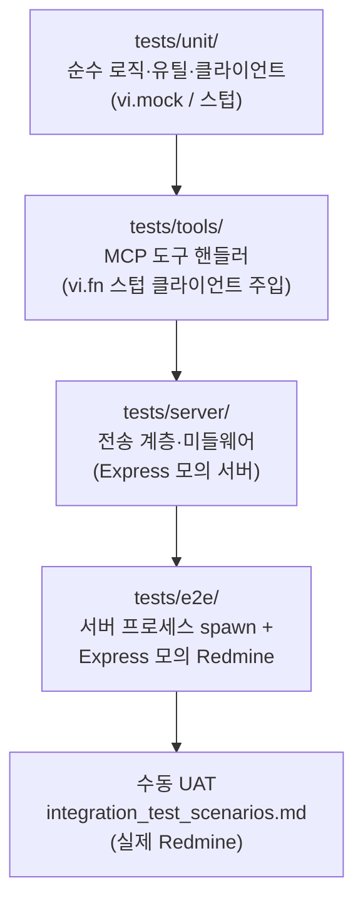

# ADR-0005: 테스트 아키텍처 개정 (실제 구조 반영 및 커버리지 기준선)

> [!abstract] 요약
> [[0002-test-architecture|ADR-0002]]를 대체(Supersede)한다. ADR-0002가 예정한 MSW/Nock 통합 테스트와 `tests/integration/`·`tests/fixtures/` 구조는 실제로 도입되지 않았고, 대신 **의존성 주입 스텁**과 **Express 모의 Redmine 서버** 기반 자동화 E2E가 자리 잡았다. 이 ADR은 현재 구조를 공식화하고 커버리지 기준선을 도입한다.

## 1. 배경 및 맥락 (Context)
2026-10-09 에이전트 규칙 점검에서 ADR-0002와 실제 테스트 구조의 불일치가 확인되었다.

| 항목 | ADR-0002 | 실제 (2026-10-09) |
|:--|:--|:--|
| 통합 테스트 도구 | MSW 또는 Nock | 사용 안 함 |
| 도구 핸들러 테스트 | (통합 테스트로 분류) | `tests/tools/` 17개 — `vi.fn()` 스텁 클라이언트를 핸들러에 주입 |
| E2E | 수동/반자동 (`integration_test_scenarios.md`) | `tests/e2e/` 자동화 — Express 모의 Redmine + 실제 서버 프로세스 spawn |
| 디렉터리 | `tests/unit`, `tests/integration`, `tests/fixtures` | `tests/unit`, `tests/tools`, `tests/server`, `tests/e2e` (+ 레거시 `test/utils`) |
| 커버리지 | 언급 없음 | 측정하지 않음 |

문서와 실제가 다르면 에이전트가 존재하지 않는 MSW 테스트를 작성하거나 규칙 전반을 신뢰하지 않게 된다.

## 2. 고려한 대안들 (Considered Options)
- **대안 1: ADR-0002대로 MSW 도입 및 테스트 재작성** — 422개 테스트 재작성 비용이 크고, 현재 방식으로 HTTP 상태 코드·에러 경로가 이미 검증되고 있어 이득이 작다.
- **대안 2: 현재 구조를 공식화하고 ADR-0002를 대체 (채택)**
- **대안 3: ADR-0002 본문만 수정** — ADR은 결정 이력이므로 덮어쓰지 않고 대체 ADR로 남긴다.

## 3. 최종 결정 (Decision)

1. **디렉터리 규약**
   - `tests/unit/`: 순수 로직, 유틸(`textileConverter`, `logger`, `prompt_injection_detector`), `RedmineClient`, `SmartNameResolver`, 미들웨어 단위.
   - `tests/tools/`: `src/tools/<name>.ts` 1:1 대응. 핸들러에 `vi.fn()` 스텁 클라이언트를 주입하고, Zod 스키마 검증·`dry_run` 기본값·에러 경로를 검증한다.
   - `tests/server/`: Streamable HTTP 러너 등 전송 계층.
   - `tests/e2e/`: 실제 서버 프로세스를 띄워 Express 모의 Redmine과 통신. 외부 네트워크에 의존하지 않는다.
   - 레거시 `test/utils/`는 `tests/unit/`으로 통합하고 `test/` 디렉터리는 사용하지 않는다.
2. **모킹 전략**: 네트워크 레벨 가로채기(MSW/Nock)는 사용하지 않는다. 외부 의존성은 (a) 의존성 주입 스텁 또는 (b) 로컬 Express 모의 서버로 통제한다. 새 테스트도 이 두 방식 중 하나를 따른다.
3. **커버리지 기준선**: `@vitest/coverage-v8`로 `src/**/*.ts`를 측정하고, `vitest.config.ts`의 `coverage.thresholds`에 측정값의 정수 내림을 기준선으로 둔다. `npm test`(= pre-commit)는 기준선 미달 시 실패한다. 커버리지를 올린 변경은 기준선도 함께 올린다(래칫).
   - 도입 시점 측정값: Statements 84.54%, Branches 83.64%, Functions 74.83%, Lines 84.73% → 기준선 84 / 83 / 74 / 84.
4. **수동 UAT**: 실제 Redmine 연동 검증은 계속 `integration_test_scenarios.md` 기반 수동 수행.

## 4. 결정 근거 (Rationale)
- 현재 방식으로 전체 스위트가 약 4초에 결정론적으로 실행되어 TDD 피드백 루프 요구(ADR-0002 4장)를 이미 충족한다.
- 커버리지 측정 오버헤드가 측정 오차 수준(약 0.1초)이라 pre-commit에 포함해도 비용이 없다.
- 기준선(래칫)은 "테스트 없는 코드 추가"를 수치로 막는 가장 단순한 장치다.

## 5. 결과 및 영향 (Consequences)
- 에이전트는 MSW 테스트를 작성하지 않는다. 새 도구는 `tests/tools/<name>.test.ts`를 함께 추가한다.
- 커버리지를 크게 떨어뜨리는 코드는 커밋할 수 없다. 의도적으로 테스트하지 않는 코드(예: 프로세스 진입점)가 늘면 기준선 조정을 DL로 남긴다.
- `tests/fixtures/` 같은 공용 픽스처 디렉터리는 필요해질 때 이 ADR을 개정해 도입한다.

## 6. 참고 및 연관 문서 (References)
- [[0002-test-architecture]] (대체됨)
- [[vibe_tdd_sop]], [[DL-0029-agent-rules-cleanup]], [[DL-0001-vitest]]
