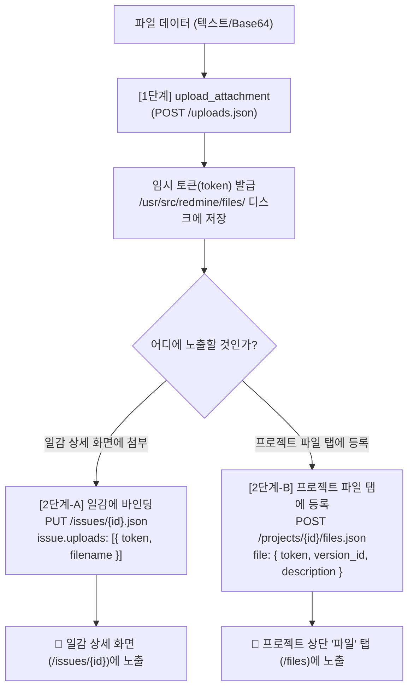

# Redmine 2단계 파일 첨부 및 파일 탭 연동 가이드 (File Attachment Guide)

> [!abstract] 개요 (Overview)
> Redmine REST API 및 MCP 도구를 활용하여 파일을 다룰 때 참고할 수 있는 기술 참조 문서입니다.
> Redmine은 물리 파일 업로드와 엔티티 바인딩이 분리된 **2단계(2-Phase) 파일 처리 구조**를 사용합니다. 1단계 업로드 후 웹 UI에 파일이 바로 보이지 않는 배경과, **일감(Issue) 첨부** 또는 **프로젝트 "파일(Files)" 탭 등록**을 위한 구체적인 연동 방법을 안내합니다.

---

## 1. 2단계 파일 처리 핵심 원리

Redmine의 파일 처리는 보안 및 무결성을 위해 2단계로 분리되어 있습니다:



> [!important] 왜 1단계 업로드 직후 웹 UI에 보이지 않는가?
> - **물리 파일은 이미 디스크에 저장됨**: 1단계(`POST /uploads.json`)가 성공하면 Redmine 서버의 저장소(예: `/usr/src/redmine/files/`)에 파일이 정상 수신 및 보관됩니다.
> - **연결된 엔티티가 없는 임시 상태**: 이 시점에는 해당 파일이 어느 일감의 부속물인지, 혹은 프로젝트 전역 파일인지 지정되지 않은 상태이므로 웹 UI에는 노출되지 않습니다.
> - **2단계 바인딩 필수**: 2단계에서 일감(`PUT /issues/{id}.json`)이나 프로젝트 파일(`POST /projects/{id}/files.json`)에 토큰을 넘겨주어야만 DB의 `attachments` 테이블에 매핑되어 화면에 표시됩니다.

---

## 2. 일감 첨부파일 vs 프로젝트 "파일" 탭 비교

| 구분 | 일감 첨부파일 (Issue Attachments) | 프로젝트 "파일" 탭 (Project Files) |
|:---|:---|:---|
| **[1단계] 파일 업로드** | `POST /uploads.json` (동일) | `POST /uploads.json` (동일) |
| **[2단계] 바인딩 API** | `PUT /issues/{id}.json` 또는 `POST /issues.json` | `POST /projects/{project_id}/files.json` |
| **요청 페이로드** | `{"issue": {"uploads": [{"token": "..."}]}}` | `{"file": {"token": "...", "version_id": 1}}` |
| **웹 UI 노출 위치** | 일감 상세 페이지 (`/issues/{id}`) 하단 | 프로젝트 상단 메뉴의 **"파일(Files)" 탭** |
| **주요 용도** | 버그 재현 스크린샷, 오류 로그 등 특정 일감 부속물 | 공식 릴리즈 패키지(zip/tar), 배포 바이너리, 프로젝트 공통 양식 |

---

## 3. 상세 연동 명세 및 페이로드 예시

### 3.1. [1단계] 파일 업로드 (`upload_attachment`)
텍스트 파일 또는 Base64 인코딩 바이너리를 업로드하여 `token`을 발급받습니다.

```json
// 텍스트 파일 업로드 예시
{
  "filename": "server_log.txt",
  "content": "2026-09-20 ERROR: Connection timeout occurred",
  "content_type": "text/plain",
  "description": "서버 장애 로그",
  "is_base64": false
}

// 이미지/바이너리 (Base64) 업로드 예시
{
  "filename": "screenshot.png",
  "content": "iVBORw0KGgoAAAANSUhEUgAAAAEAAAABCAYAAAAfFcSJAAAADUlEQVR42mNk+M9QDwADhgGAWjR9awAAAABJRU5ErkJggg==",
  "content_type": "image/png",
  "description": "버그 재현 스크린샷",
  "is_base64": true
}
```

* **응답 결과**:
  ```json
  {
    "token": "1.e2518b5f89bcb024e409c0d67bccf4e0a0e378d429709972f72e34287c70e5d5",
    "filename": "server_log.txt",
    "content_type": "text/plain",
    "message": "File 'server_log.txt' uploaded successfully."
  }
  ```

---

### 3.2. [2단계-A] 일감에 첨부 바인딩
발급받은 `token`을 일감의 `uploads` 필드에 전달합니다.

* **엔드포인트**: `PUT /issues/{issue_id}.json` (수정) 또는 `POST /issues.json` (신규 생성)
* **페이로드**:
  ```json
  {
    "issue": {
      "notes": "요청하신 로그 파일을 첨부합니다.",
      "uploads": [
        {
          "token": "1.e2518b5f89bcb024e409c0d67bccf4e0a0e378d429709972f72e34287c70e5d5",
          "filename": "server_log.txt",
          "description": "서버 장애 로그",
          "content_type": "text/plain"
        }
      ]
    }
  }
  ```

---

### 3.3. [2단계-B] 프로젝트 "파일" 탭에 등록
발급받은 `token`을 프로젝트 파일 API에 전달합니다. 선택적으로 마일스톤 버전(`version_id`)을 연결할 수 있습니다.

* **엔드포인트**: `POST /projects/{project_id}/files.json`
* **페이로드**:
  ```json
  {
    "file": {
      "token": "3.e1892fb847028eccf600c862aaa3d8f9dd96b257c9fbfc1116dcc76ffb850292",
      "description": "프로젝트 v1.0.0 릴리즈 배포 패키지",
      "version_id": 1
    }
  }
  ```

---

## 4. 확인 및 검증 방법

1. **일감 첨부 확인**:
   - `get_issue_details(issue_id: 3, include_attachments: true)` 도구 호출.
   - 웹 브라우저: `http://localhost:3000/issues/3` 하단 첨부파일 영역 확인.
2. **프로젝트 파일 탭 확인**:
   - `GET /projects/{project_id}/files.json` 호출.
   - 웹 브라우저: `http://localhost:3000/projects/{project_id}/files` 확인.
3. **디스크 물리 파일 직접 확인 (Docker 인프라)**:
   ```bash
   docker exec local-redmine ls -la /usr/src/redmine/files/2026/09/
   ```

---

## 5. 실무 참고사항 (Tips & Troubleshooting)

> [!tip] Base64 접두사 처리
> `upload_attachment` 도구는 `data:image/png;base64,` 형태의 Data URL 접두사를 자동으로 감지 및 제거(strip)하므로, 원본 Data URL을 그대로 전달해도 무방합니다.

> [!warning] 임시 토큰 만료
> 1단계에서 발급된 토큰은 임시 상태입니다. 일정 기간 바인딩되지 않은 임시 파일은 Redmine의 일일 정리 작업에 의해 자동 회수되므로 업로드 직후 바인딩을 권장합니다.

> [!caution] 파일 크기 제한
> Redmine 관리자 설정(`관리 > 설정 > 파일`)의 "첨부파일 최대 크기"를 초과하면 `422 Unprocessable Entity` 에러가 발생합니다.

---

#guide #reference #attachment #upload #files-tab #redmine #mcp #api
