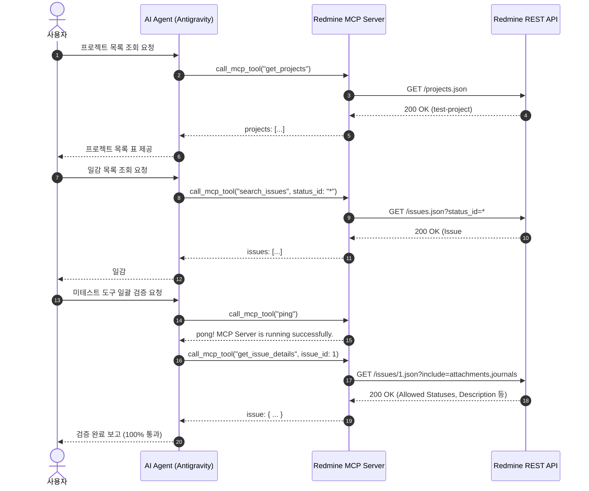

# DL-0005: Redmine 라이브 MCP 도구 4종 검증 및 1단계 MVP 인수 완료

> [!abstract] 요약
> 실제 Redmine 인스턴스와 연동하여 기구현된 MCP 도구 4종(`ping`, `get_projects`, `search_issues`, `get_issue_details`)에 대한 라이브 전수 검증을 완료하였습니다. 모든 도구가 100% 정상 동작함을 확인하고, 1단계(MVP 조회 전용 도구)를 공식 완료 처리하며 다음 세션부터 2단계(쓰기 기능)로 전환하기로 결정합니다.

---

## 1. 주제 (Topic)
실제 Redmine 서버와의 연동 환경에서 MCP 도구 4종의 동작 상태 검증 및 1단계(MVP 조회 전용) 완료 판정.

---

## 2. 결정 사항 (Decision)
1. **MVP 1단계 기능 인수 완료**: 도구 4종 전수 테스트가 100% 통과(PASS)하였으므로, 1단계 조회를 위한 도구 세트를 안정화 버전으로 확정한다.
2. **차기 스프린트(2단계) 이행 결정**: 다음 세션부터 일감 생성/수정(Write) 및 시간 기록 도구 개발 작업으로 전환한다.

---

## 3. 이유 (Reasoning)
- `ping`: 서버 연결 및 프로토콜 헬스체크 정상 응답 수신 (`pong!`).
- `get_projects`: 실제 프로젝트(`test-project`, ID: 1) 및 트래커 목록 정상 수신.
- `search_issues`: 쿼리 및 필터(`status_id: "*"`) 기반 실제 일감(#1) 검색 및 파싱 성공.
- `get_issue_details`: 일감 #1의 본문, 작성자, 6개 전이 가능 상태(`allowed_statuses`) 및 빈 첨부파일/댓글 배열 안전 처리 확인.
- 모든 스키마 및 Zod 파싱 로직이 실제 Redmine API 응답과 오차 없이 일치함을 실측 검증 완료.

---

## 4. 검증 상세 내역 및 아키텍처 흐름

### 테스트 시퀀스 흐름

### 도구별 검증 결과 요약표

| 번호 | 도구명 | 검증 인자 (Arguments) | 결과 | 상세 내용 |
|:---:|:---|:---|:---:|:---|
| 1 | `ping` | `{}` | ✅ **PASS** | 서버 연결 헬스체크 정상 (`pong! MCP Server is running successfully.`) |
| 2 | `get_projects` | `{"include_archived": false}` | ✅ **PASS** | `test-project` (ID: 1, 트래커 3종) 반환 |
| 3 | `search_issues` | `{"status_id": "*"}` | ✅ **PASS** | 전체 일감 중 #1 ('Redmine MCP 연동 확인용 첫 번째 일감') 조회 |
| 4 | `get_issue_details` | `{"issue_id": 1, "include_journals": true, "include_attachments": true}` | ✅ **PASS** | #1 상세 본문, 작성자, 6개 전이 상태(`allowed_statuses`) 확인 |

---

## 5. 후속 조치 (Action Items)
- [ ] 2단계 신규 일감 등록 도구 (`create_issue`) TDD 구현
- [ ] 2단계 일감 수정 및 댓글 추가 도구 (`update_issue`) TDD 구현
- [ ] 파괴적 작업 방어 가드레일 (`confirm_delete`) 적용
- [ ] 소요 시간 기록 도구 (`create_time_entry`) 구현

---

#DL #decision-log #test #uat #mcp #redmine #live-verification
