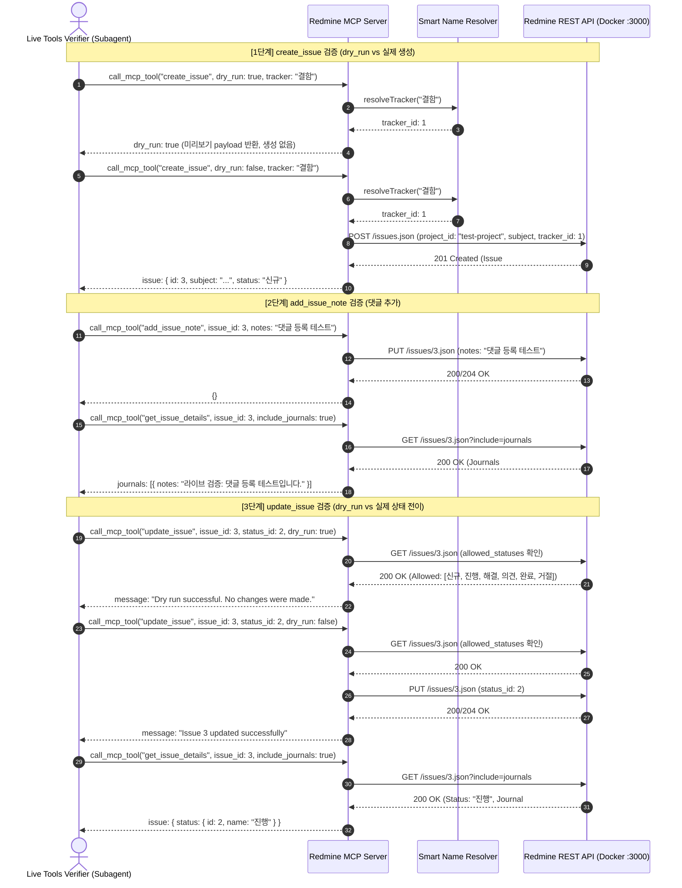

# DL-0009: 2단계 쓰기 도구 3종 라이브 검증 및 안정성 인수 완료

> [!abstract] 요약
> 로컬 Docker Redmine 인스턴스(포트 3000)를 대상으로 2단계 핵심 쓰기 도구 3종(`create_issue`, `add_issue_note`, `update_issue`)에 대한 라이브 전수 UAT(인수 검증)를 수행하였습니다. `dry_run` 가드(시뮬레이션 및 사전 검증), Smart Name Resolver 자동 변환, 실제 일감 생성, 댓글 등록, 상태 전이 및 감사 저널(Journal) 기록까지 모든 시나리오가 100% 정상 통과함을 확인하고 쓰기 도구 세트의 프로덕션 안정성을 공식 승인합니다.

---

## 1. 주제 (Topic)
실제 Redmine 서버 연동 환경에서 2단계 쓰기 도구 3종(`create_issue`, `add_issue_note`, `update_issue`)의 안전 가드(`dry_run`), Smart Name Resolver 연동, 실제 데이터 조작 및 저널 기록 동작 전수 검증.

---

## 2. 결정 사항 (Decision)
1. **2단계 쓰기 기능 인수 완료 (UAT PASS)**:
   - `create_issue`: `dry_run: true` 시뮬레이션 미리보기 및 `dry_run: false` 실제 일감(#3) 정상 생성 확인.
   - `add_issue_note`: 일감 #3에 대한 신규 댓글(Journal) 추가 및 즉각 반영 확인.
   - `update_issue`: `dry_run: true` 상태 전이 시뮬레이션 검증 및 `dry_run: false` 실제 상태 전이(신규 1 ➔ 진행 2) 및 이력 저널 확인.
2. **2단계 쓰기 기능 정식 배포 가능 판정**: 3종 도구의 모든 파라미터 유효성 검사, 에러 핸들링, 비즈니스 가드가 규격에 부합함을 확인하여 완료 처리한다.

---

## 3. 이유 (Reasoning)
- **`create_issue` 안전성 실측 검증**:
  - `dry_run: true` 호출 시 실제 Redmine DB에 레코드를 생성하지 않고 `message`와 해석된 `payload`만 반환하여 LLM 에이전트의 확인 절차를 유도함을 검증.
  - Smart Name Resolver가 한글 트래커 이름(`"tracker": "결함"`)을 숫자 ID(`tracker_id: 1`)로 자동 변환하여 Redmine REST API에 안전하게 전달함을 확인.
  - `dry_run: false` 실행 시 일감 #3이 성공적으로 생성되고 ID 및 기본 속성이 정상 반환됨.
- **`add_issue_note` 댓글 등록 검증**:
  - 생성된 일감 #3에 대해 `add_issue_note`를 호출하여 저널(Journal #4)이 성공적으로 등록됨을 `get_issue_details`로 교차 검증 완료.
- **`update_issue` 워크플로우 보호 및 상태 전이 검증**:
  - `dry_run: true` 호출 시 `allowed_statuses`를 기준으로 유효성을 사전 검증하고 변경 없이 안전 반환됨을 확인.
  - `dry_run: false` 호출 시 실제 상태가 '신규'(ID: 1)에서 '진행'(ID: 2)으로 갱신되었으며, Redmine 저널에 상태 변경 이력(`old_value: "1"`, `new_value: "2"`)이 올바르게 기록됨을 확인.
- 전체 단위 테스트(66개 전수) 및 라이브 API 호출 결과 모두 결함 없이 통과.

---

## 4. 검증 상세 내역 및 시퀀스 흐름

### 테스트 시퀀스 흐름

### 도구별 검증 결과 요약표

| 번호 | 도구명 | 검증 인자 (Arguments) | 결과 | 상세 내용 |
|:---:|:---|:---|:---:|:---|
| 1 | `create_issue` (1차) | `{"project_id": "test-project", "subject": "라이브 검증: 쓰기 도구 테스트 일감", "tracker": "결함", "dry_run": true}` | ✅ **PASS** | 시뮬레이션 미리보기 반환 (`message`, `payload: {tracker_id: 1}`). 실제 일감 생성되지 않음 확인. |
| 2 | `create_issue` (2차) | `{"project_id": "test-project", "subject": "라이브 검증: 쓰기 도구 테스트 일감", "tracker": "결함", "dry_run": false}` | ✅ **PASS** | 실제 일감(#3) 생성 완료 (`id: 3`, `status: "신규"`, `tracker: "결함"`, `author: "Redmine Admin"`). |
| 3 | `add_issue_note` | `{"issue_id": 3, "notes": "라이브 검증: 댓글 등록 테스트입니다."}` | ✅ **PASS** | 일감 #3에 댓글 정상 등록. `get_issue_details`로 저널(#4) 및 본문 내용 일치 확인. |
| 4 | `update_issue` (1차) | `{"issue_id": 3, "status_id": 2, "dry_run": true}` | ✅ **PASS** | 상태 전이 시뮬레이션 성공 (`updates: {status_id: 2}`). 실제 상태 변경 없음 확인. |
| 5 | `update_issue` (2차) | `{"issue_id": 3, "status_id": 2, "dry_run": false}` | ✅ **PASS** | 상태 전이 실행 완료. `get_issue_details`로 상태 '진행'(ID: 2) 갱신 및 저널(#5) 이력(`status_id: 1 -> 2`) 반영 확인. |

---

## 5. 후속 조치 (Action Items)
- [x] 2단계 쓰기 도구 3종 라이브 검증 완료
- [x] `document/todo.md` 대기열 갱신 (`test/live-write-tools-verification` 완료 처리)
- [ ] Markdown ↔ Textile 상호 변환 파이프라인 (`feature/textile-markdown-converter`) 구현
- [ ] 작업 시간 기록 도구 (`feature/log-time`) TDD 구현
- [ ] 위키 문서 목록 및 상세 조회 (`feature/search-wiki`) TDD 구현

---

#DL #decision-log #test #uat #mcp #redmine #live-verification #write-tools
