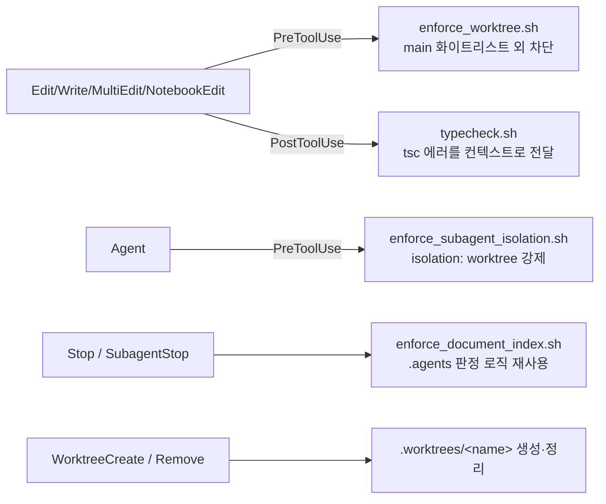

# DL-0027: Claude Code 에이전트 환경 지원 (Antigravity 병행)

## 1. 주제 (Topic)
프로젝트의 에이전트 가드레일(훅·스킬·서브에이전트)이 Google Antigravity 전용(`.agents/`, `invoke_subagent`, `write_to_file` 등)으로만 구성되어 있어, Claude Code에서 작업할 때 TDD·워크트리·문서 인덱스 규약이 강제되지 않는다.

## 2. 결정 사항 (Decision)
Antigravity 설정은 그대로 유지하고, 동일한 규약을 강제하는 **Claude Code 레이어를 병행 추가**한다.

| 구성 요소 | 파일 | 대응하는 Antigravity 요소 |
|:---|:---|:---|
| 프로젝트 지침 | `CLAUDE.md` (`@AGENTS.md` import + 도구 대응표) | `AGENTS.md` |
| 훅 등록 | `.claude/settings.json` | `.agents/hooks.json` |
| 훅 어댑터 | `.claude/hooks/*.sh` | `.agents/scripts/*.sh` |
| 스킬 | `.claude/skills/{vibe-tdd-workflow,git-workflow}` | `.agents/skills/*` |
| 리뷰어 서브에이전트 | `.claude/agents/{security,deep}-code-reviewer.md` | SOP의 `security_code_reviewer`, `deep_code_reviewer` |
| 로컬 MCP 서버 | `.mcp.json` (환경변수 확장, 비밀값 미포함) | `.vscode/mcp.json` |

훅 매핑:

- **워크트리 경로**: Claude Code 기본값(`.claude/worktrees/`) 대신 WorktreeCreate 훅으로 기존 규약인 `.worktrees/<name>`(브랜치 `worktree-<name>`, 메인 체크아웃의 현재 HEAD 기준)을 유지한다. 메인 저장소의 `node_modules`를 심볼릭 링크로 공유한다.
- **WorktreeRemove**: 커밋하지 않은 변경이 있으면 워크트리를 보존하고, 브랜치는 병합된 경우에만 삭제한다(작업 유실 방지).
- **편집 가드 강화**: `.`/`..` 세그먼트 경로, `.git/` 내부 파일, 심볼릭 링크 편집을 거부한다. `jq` 부재·깨진 입력 JSON은 exit 2로 차단(fail-closed)한다. 화이트리스트는 Antigravity `enforce_worktree.sh`와 동일하게 유지한다(`.husky/pre-commit` 커밋 화이트리스트보다 엄격).
- **서브에이전트 격리 허용값**: `isolation: "worktree"` 또는 `"remote"`.
- **서브에이전트 격리 예외**: 파일을 수정하지 않는 `Explore`, `Plan`, `claude-code-guide`, `statusline-setup`, 리뷰어 에이전트는 격리 없이 호출 가능하다. 세션이 이미 워크트리 안에 있으면 검사하지 않는다.
- **문서 인덱스 훅**: 판정 로직은 `.agents/scripts/enforce_document_index.sh`를 그대로 호출하고, 출력만 Claude Code 형식(`decision: "block"`)으로 변환한다. `stop_hook_active`면 통과시켜 무한 차단을 막는다.

## 3. 이유 (Reasoning)
- 판정 규칙을 한 곳(`.agents/scripts/` 및 동일 화이트리스트)에 두어 두 에이전트 간 정책 차이를 막는다.
- Claude Code 훅의 입출력 스키마(`tool_input.file_path`, `hookSpecificOutput.permissionDecision`, `decision: "block"`)가 Antigravity와 달라 어댑터가 필요하다.
- PreToolUse deny는 권한 모드(bypass 포함)와 무관하게 적용되므로 가드레일로서 유효하다.
- 기존 `.vscode/mcp.json`은 API 키를 평문으로 담고 있어, 커밋되는 `.mcp.json`은 `${REDMINE_API_KEY}` 확장만 사용한다.

## 4. 후속 조치 (Action Items)
- [x] `.claude/hooks/test_claude_hooks.sh` 검증 스위트 작성 (44건, 리뷰 지적 사항 회귀 테스트 포함)
- [x] `.agents/skills/vibe-tdd-workflow`의 잘못된 SOP 경로(`document/vibe_tdd_sop.md`) 수정
- [ ] Claude Code 세션에서 `REDMINE_API_KEY`를 셸 환경변수로 export 후 `/mcp`로 redmine 서버 연결 확인
- [ ] **알려진 한계**: `Bash` 도구를 통한 파일 쓰기(`sed -i`, 리다이렉션 등)는 편집 가드가 검사하지 않는다(Antigravity와 동일). main 저장소 보호는 커밋 시점의 `.husky/pre-commit`이 최종 방어선이다. 읽기 전용 예외 에이전트도 Bash를 보유한다.
- [ ] SOP 본문의 Antigravity 도구명은 `CLAUDE.md` 대응표로 해석 — 향후 SOP 개정 시 도구 중립 표현으로 정리 검토
