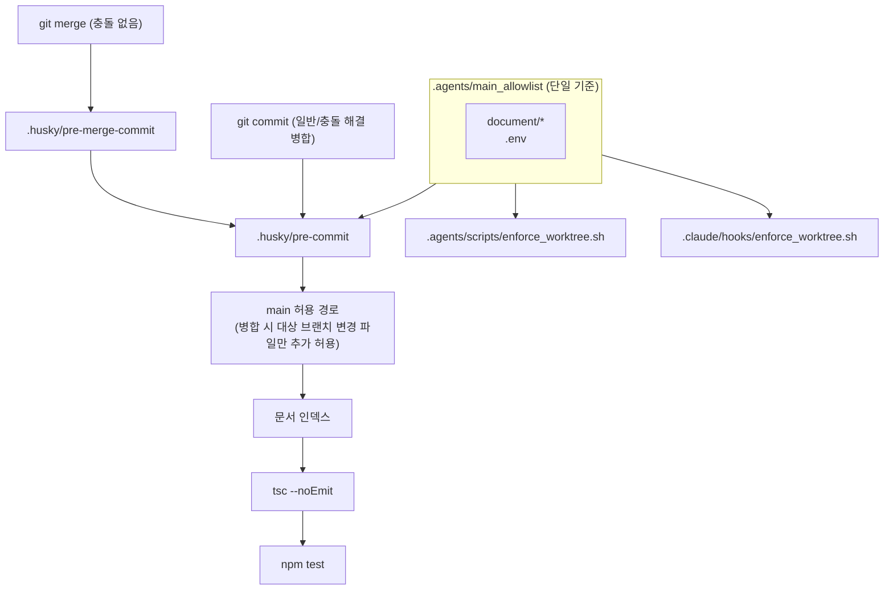

# DL-0028: 에이전트 가드레일 구멍 보완 및 todo.md 소유권 정리

## 1. 주제 (Topic)
에이전트 규칙 점검(2026-10-09) 결과, 가드레일이 실제로는 적용되지 않거나 문서끼리 상충하는 지점이 발견되었다. 재현 테스트로 확인된 사항은 다음과 같다.

| # | 문제 | 영향 |
|:--|:--|:--|
| 1 | `core.hooksPath=.husky/_`(상대 경로)가 워크트리 루트 기준으로 해석되는데 워크트리에는 `.husky/_`가 없음 | **워크트리(서브에이전트) 커밋에서 husky 훅이 전혀 실행되지 않음** — 잘못된 커밋 메시지도 통과 |
| 2 | 충돌 없는 `git merge`는 `pre-merge-commit` 훅을 호출하는데 해당 훅이 없음 | 일반 병합 커밋이 어떤 검사도 거치지 않음 |
| 3 | pre-commit이 `MERGE_HEAD` 존재 시 `exit 0` | 충돌 해결 병합에서 임의 파일을 끼워 넣어 main에 커밋 가능 |
| 4 | main 커밋 허용 목록에 `.husky/*` 포함, commit-msg 코어 목록에 `.husky/`·`.claude/`·`CLAUDE.md` 누락 | 에이전트가 훅을 약화시켜 main에 바로 커밋 가능 |
| 5 | main 허용 경로가 편집 훅 2곳·pre-commit 1곳에 각각 하드코딩되어 서로 다름 | SOP 문서 편집은 차단되는데 커밋은 허용되는 등 불일치 |
| 6 | pre-commit에 타입 검사 없음 (vitest는 타입 에러를 잡지 않음) | 타입 에러가 있는 코드 커밋 가능 |
| 7 | vitest 설정 파일 부재로 `.worktrees/` 하위 테스트 사본까지 수집 | main에서 `npm test` 시 테스트 중복 실행(56개 중 28개가 사본)·상호 간섭 |
| 8 | 서브에이전트가 브랜치에서 todo.md `[x]` 처리(SOP 6단계, DL-0008) ↔ todo 변경은 사용자 승인 필요(AGENTS.md 8장) | 규칙 상충, 병렬 브랜치 간 todo.md 병합 충돌 |
| 10 | `git mv`(이름 변경)는 `--name-only`에 새 경로만 표시 | `.husky/*`를 `document/`로 옮겨 main에서 가드레일 삭제 + `[Impact-Reviewed]` 검사 회피 |
| 11 | `core.quotePath` 기본값으로 한글 경로가 이스케이프되어 출력 | 한글 문서 main 커밋 오차단, 한글 코어 파일 경로는 `[Impact-Reviewed]` 검사 누락 |
| 12 | main 체크아웃의 `cherry-pick`/`revert`/`am`은 pre-commit·commit-msg를 거치지 않음 | 검사 없이 main에 코드 반영 |
| 9 | vibe SOP 6장이 폐지된 "Queue Error 차단"을 전제로 "todo.md 순서를 바꿔 재커밋"을 지시 | AGENTS.md 8장(승인 없는 순서 변경 금지)과 정면 충돌 |

## 2. 결정 사항 (Decision)

0. **(2차 리뷰 반영) 위조·우회 차단**:
   - 자동 병합 판정은 환경변수가 아닌 **위치 인자**(`--from-pre-merge-commit`)로만 한다. `git commit`은 pre-commit에 인자를 넘기지 않으므로 위조 불가.
   - main 허용 경로 정책은 작업 트리가 아니라 **HEAD에 커밋된 버전**(`git show HEAD:...`)을 읽는다.
   - 스테이징 목록은 `git -c core.quotePath=false diff --cached --name-only --no-renames`로 구한다(pre-commit·commit-msg 공통).
   - `.env` 계열 파일(`.env.example` 제외)은 어느 체크아웃에서도 커밋 차단. `tsconfig.json`·`test` 스크립트가 없으면 fail-closed. detached HEAD 허용.
   - 편집 훅은 `MAIN_ALLOWLIST_FILE` 환경변수를 무시하고, Antigravity 편집 훅도 `.`/`..` 세그먼트 경로를 거부한다.
   - Claude `PreToolUse(Bash)` 훅(`.claude/hooks/guard_bash.sh`): `--no-verify`, `HUSKY=0`, `core.hooksPath` 변경, `PRE_MERGE_COMMIT=` 위조, main 체크아웃에서의 `cherry-pick`/`revert`/`am` 차단.
1. **훅 설치 경로 고정**: `prepare` 스크립트를 `.agents/scripts/install_git_hooks.sh`로 교체. husky 설치 후 `core.hooksPath`를 메인 저장소 `.husky/_`의 **절대 경로**로 설정해 모든 워크트리에서 훅이 실행되게 한다. 워크트리 커밋은 main의 훅 스크립트로 검사되며, 브랜치에서 수정한 훅은 병합 후 적용된다.
2. **병합 커밋 검사**: `.husky/pre-merge-commit`이 pre-commit을 호출한다. pre-commit의 `MERGE_HEAD` 즉시 통과 로직을 제거하고 문서 인덱스·타입·테스트 검사를 동일하게 수행한다.
   - 충돌 없는 자동 병합(`pre-merge-commit` 경유): git이 인덱스에 별도 스테이징이 있으면 병합을 거부하므로 스테이징 내용 = 병합 결과. 허용 경로 검사만 생략한다.
   - 충돌 해결 후 `git commit`(MERGE_HEAD 존재): 허용 경로 + **병합 대상 브랜치가 변경한 파일**(`git diff --name-only HEAD...MERGE_HEAD`)만 허용한다.
3. **허용 경로 단일화**: `.agents/main_allowlist`(glob 목록)를 신설하고 `.agents/scripts/main_allowlist.sh`의 `is_main_allowed`로 판정한다. 현재 값은 `document/*`, `.env`. 가드레일 파일(`.husky/`, `.agents/`, `.claude/`, `AGENTS.md`, `CLAUDE.md`)은 목록에 넣지 않는다.
4. **코어 파일 확대**: commit-msg의 `[Impact-Reviewed]` 대상에 `.husky/`, `.claude/`, `CLAUDE.md`, `.mcp.json` 추가. 매칭을 정규식(`grep "^$core"`)에서 접두사 비교(`case`)로 변경.
5. **pre-commit 타입 검사**: `node_modules/.bin/tsc --noEmit` 단계 추가. tsc가 없으면 fail-closed.
6. **vitest 수집 범위**: `vitest.config.ts`를 추가해 `**/.worktrees/**`, `**/.claude/worktrees/**` 제외.
7. **todo.md 소유권**: 메인 에이전트 전담. 서브에이전트는 브랜치에서 todo.md를 수정하지 않고 최종 보고만 한다. 메인 에이전트가 병합 직후 main에서 `[x]` 처리한다. 완료 처리는 승인 불필요, 추가·순서 변경만 승인 대상. **DL-0008을 대체한다.**
8. **SOP 정비**: vibe SOP 6단계·6장(무한 루프 방지)과 git SOP 단계 2·3을 위 규칙에 맞게 개정하고 SOP 5장의 리터럴 `\n` 오류를 수정.

## 3. 이유 (Reasoning)
- 가드레일의 신뢰성은 "실제로 실행되는가"에 달려 있다. 1·2번은 규칙 문서가 아무리 정교해도 서브에이전트 커밋과 병합에서 검사가 0건이었음을 의미한다.
- 허용 경로를 한 파일로 모으면 정책 변경 시 세 곳의 불일치가 원천적으로 사라지고, 정책 파일 자체가 `.agents/` 하위라 main에서 수정할 수 없다.
- todo.md를 메인 세션이 소유하면 승인 규칙과 완료 동기화 규칙이 충돌하지 않고, 병렬 브랜치의 todo.md 충돌도 사라진다.

## 4. 후속 조치 (Action Items)
- [x] `.agents/scripts/test_git_policy.sh` (임시 복제 저장소에서 실제 커밋·병합·충돌 해결로 48건, 실패 사유까지 검증), `.claude/hooks/test_claude_hooks.sh` (임시 복제 저장소, 64건)
- [x] 병합만으로는 기존 저장소의 `core.hooksPath`가 바뀌지 않는다. **병합 후 메인 저장소에서 `npm run prepare` 1회 실행 필수.** 이후 상대 경로로 되돌아가더라도 Claude Code의 WorktreeCreate 훅이 워크트리 생성 시 절대 경로로 복구한다.

### 알려진 한계 (의도적 수용)
- 위협 모델은 "실수·편의상 우회"이며, 의도적으로 악의적인 로컬 프로세스(`.git/config` 직접 수정, main의 `.husky/pre-commit` 셸 수정)는 범위 밖이다. 최종 방어선은 원격 저장소의 서버 측 검사(CI, 브랜치 보호)가 되어야 한다.
- 충돌 해결 병합(MERGE_HEAD 경로)에서는 병합 대상 브랜치가 변경한 파일의 **내용**은 임의로 바꿀 수 있다(tsc·테스트는 여전히 실행됨).
- `guard_bash.sh`는 명령 문자열 기반 검사라 셸 변수·스크립트 파일을 통한 간접 실행은 탐지하지 못한다. Antigravity에는 Bash 훅이 없다.
- 예전 브랜치(`prepare`가 `husky`인 시점)의 워크트리에서 `npm install`을 실행하면 공유 config가 상대 경로로 되돌아갈 수 있다.
- [ ] (점검 보고서 4~5번, 별도 작업) AGENTS.md 4장의 낡은 규칙(도구 5~7개, `confirm_delete`), ADR-0002 테스트 구조, 템플릿 frontmatter, 브랜치 네이밍 규칙 정비
- [ ] (점검 보고서 TDD 효율 항목, 별도 작업) 리뷰 범위 구분, 커버리지 기준선, DL 작성 조건 축소
