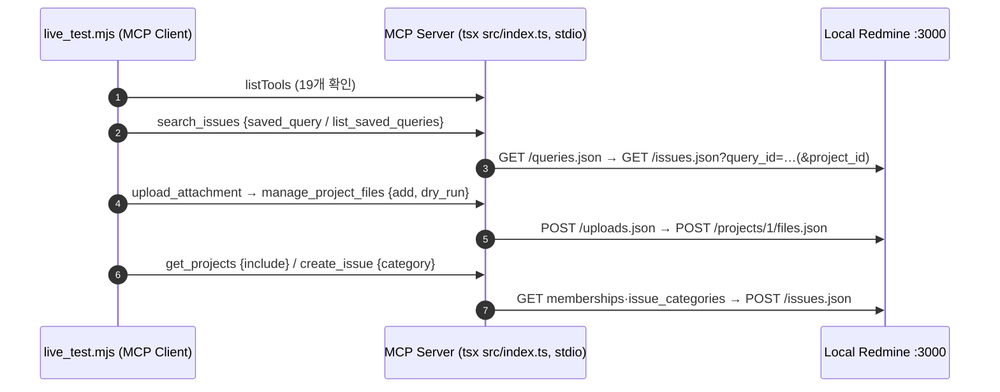

# DL-0034: API 커버리지 확장 기능 3종 라이브 검증

> [!abstract] 요약
> 로컬 Docker Redmine(`local-redmine`, `http://localhost:3000`)을 대상으로 DL-0031~0033에서 병합한 기능 3종(저장된 필터, 프로젝트 파일 탭, 멤버십·일감 범주)을 **실제 MCP stdio 프로토콜**로 호출해 20개 시나리오를 검증했다. 20/20 통과했으며, 검증 중 `manage_project_files`의 404 오류 메시지가 원인을 잘못 안내하는 결함 1건을 발견해 `fix/project-files-404-message`로 수정했다.

---

## 1. 주제 (Topic)
단위 테스트(DI 스텁·모의 응답)로만 검증된 신규 기능이 실제 Redmine의 응답 형식·권한·스코프 규칙과 맞는지 확인한다. 특히 서브에이전트들이 "실서버 미검증"으로 보고한 항목을 해소한다.
- DL-0031: `/queries.json` 응답 형식, 프로젝트 전용 필터의 스코프 규칙(다른 스코프에서 404)
- DL-0032: Files API 등록 성공 응답 코드, 버전 소유 검증
- DL-0033: 멤버십(사용자/그룹) 응답 형식, 범주 기본 담당자, `create_issue` 범주 반영

---

## 2. 결정 사항 (Decision)
1. **3종 기능 라이브 인수 완료 (UAT PASS, 20/20)**.
2. **결함 1건 수정**: 무효·만료 업로드 토큰으로 파일 탭 등록 시 Redmine은 `404`를 반환하는데, 도구가 이를 "해당 프로젝트를 찾을 수 없습니다"로 변환해 LLM을 잘못된 원인으로 유도함 → `add` 경로의 404 안내에 토큰 무효·만료 가능성과 재발급 방법을 포함하도록 수정.
3. **검증 방식 표준화**: 세션에 이미 연결된 MCP 서버는 기동 시점 코드로 동작하므로, 병합 직후 검증은 **최신 `src/index.ts`를 별도 stdio 프로세스로 띄워 MCP SDK 클라이언트로 호출**하는 방식을 사용한다.

---

## 3. 검증 환경 및 방법

| 항목 | 값 |
|:--|:--|
| Redmine | Docker `redmine:latest` + `postgres:15-alpine`, 관리자 계정(API Key, `.env`) |
| 대상 코드 | main `c752e25` (DL-0031~0033 병합 완료 시점) |
| 호출 경로 | `@modelcontextprotocol/sdk` `Client` + `StdioClientTransport` → `tsx src/index.ts` (`TRANSPORT=stdio`) |
| 스크립트 | 세션 scratchpad의 `live_test.mjs` (저장소 외부, 재현 시 아래 시나리오 표 기준으로 재작성 가능) |

### 테스트 픽스처 (`MCP-TEST` 접두어, 로컬 Redmine에 유지)
| 종류 | 내용 | 생성 방법 |
|:--|:--|:--|
| 저장된 필터 | `MCP-TEST 미해결 결함`(id 8, test-project 전용), `내가 맡은 일감`(id 9, test-project 전용 — 공용 id 1과 **동명**) | `rails runner` (Queries는 REST 생성 API 없음) |
| 일감 범주 | `MCP-TEST UI`(기본 담당자 admin), `MCP-TEST 백엔드` | REST |
| 사용자/그룹 | 사용자 `mcptest`(id 5, 역할 개발자), 그룹 `MCP-TEST 그룹`(id 6, 역할 보고자) 멤버십 | REST |
| 버전 | `MCP-TEST v1` | REST |
| 검증 산출물 | 일감 #7·#8(범주 `MCP-TEST 백엔드`), 파일 탭 `mcp-test-notes.txt` 2건(버전 `MCP-TEST v1`) — 재검증 실행분 포함 | MCP 도구 |

---

## 4. 시나리오별 결과

### 공통
| ID | 시나리오 | 결과 |
|:--|:--|:--|
| 0 | 도구 19개 노출, `manage_project_files` 포함 | ✅ |

### 저장된 필터 (DL-0031)
| ID | 시나리오 | 결과 |
|:--|:--|:--|
| A1 | `list_saved_queries` 전체 → 6건(공용 4 + 전용 2) | ✅ |
| A2 | `list_saved_queries` + `project_id: test-project` → 전용+공용 6건 | ✅ |
| A3 | 전용 필터명을 프로젝트 없이 지정 → id 8 해석, 해당 프로젝트로 자동 스코프(`_resolved_saved_query.project_scope_applied`), 일감 4건 | ✅ |
| A4 | 동명 필터 + 프로젝트 지정 → 전용 id 9 우선 | ✅ |
| A5 | 동명 필터 + 프로젝트 미지정 → 공용 id 1 선택 | ✅ |
| A6 | `"  mcp-test 미해결 결함 "` (대소문자·공백 차이) → id 8 | ✅ |
| A7 | 없는 필터명 → `Saved query not found … use list_saved_queries` 안내 | ✅ |

### 프로젝트 파일 탭 (DL-0032)
| ID | 시나리오 | 결과 |
|:--|:--|:--|
| B1 | `list` → 기존 파일 1건 | ✅ |
| B2 | `upload_attachment` 토큰 발급 | ✅ |
| B3 | `add` 기본값(`dry_run: true`) → 미리보기(토큰 마스킹, 버전 `mcp-test v1` → id 해석), 실제 미등록 확인 | ✅ |
| B4 | `add` `dry_run: false` → `File registered to project 1 successfully`, 목록에 버전과 함께 반영 | ✅ |
| B5 | 없는 버전명 → `Version '없는버전' not found in project.` | ✅ |
| B6 | 무효 토큰 `dry_run: false` → 에러 객체 반환 | ✅ (단, 메시지 결함 → §5) |
| B7 | `project_id: ".."` → 스키마 검증 거부 | ✅ |

### 멤버십·일감 범주 (DL-0033)
| ID | 시나리오 | 결과 |
|:--|:--|:--|
| C1 | `get_projects` `include: [memberships, issue_categories]` → 사용자(개발자)·그룹(보고자) 2건, 범주 2건(기본 담당자 표시), `mail`/`login` 미노출, `project.issue_categories` 중복 제거 | ✅ |
| C2 | `include`를 `project_id` 없이 → 안내 에러 | ✅ |
| C3 | `create_issue` `category: "mcp-test ui"` 미리보기 → `category_id: 1` | ✅ |
| C4 | `create_issue` `dry_run: false` → 일감 #7 생성, `get_issue_details`로 범주 `MCP-TEST 백엔드` 확인 | ✅ |
| C5 | 없는 범주명 → 범주 목록 비노출 안내 에러 | ✅ |

> [!note] Redmine 실측 동작 확인
> - Files API 등록 성공 시 본문이 비어 있으며, 도구가 안내 메시지로 정규화함(DL-0032 가정 일치).
> - **무효 토큰으로 `POST /projects/{id}/files.json` → HTTP 404** (빈 본문). 프로젝트 부재와 상태 코드만으로는 구분 불가.
> - 전용 필터는 해당 프로젝트 스코프에서만 결과를 반환함(DL-0031의 자동 스코프 설계 근거 확인).

---

## 5. 발견 결함 및 조치

| 항목 | 내용 |
|:--|:--|
| 증상 | 무효·만료 토큰으로 `manage_project_files` `add` 실행 시 `해당 프로젝트를 찾을 수 없습니다: test-project` 반환 (프로젝트는 정상) |
| 원인 | `toFriendlyError`가 404를 일괄 "프로젝트 없음"으로 변환. Redmine은 토큰 무효 시에도 404 반환 |
| 영향 | LLM이 프로젝트 식별자를 의심해 잘못된 재시도를 수행할 수 있음 (보안 영향 없음) |
| 조치 | 브랜치 `fix/project-files-404-message` (병합 `57f6f5a`) — `add` 경로 404 안내에 토큰 무효·만료 가능성과 `upload_attachment` 재발급 안내 포함, `list` 경로는 기존 메시지 유지. 버전 해석 과정에서 이미 확인된 사실(프로젝트 존재·버전 소유)은 추가 API 호출 없이 원인 목록에서 제외 |
| 재검증 | B6 응답: `파일 등록 실패 (404 Not Found). 가능한 원인: (1) 업로드 토큰(token)이 유효하지 않거나 만료되었거나 이미 사용됨 → upload_attachment 로 다시 업로드해 새 토큰을 발급받으세요 / (2) 프로젝트를 찾을 수 없음: test-project` |
| 미반영 (보안 리뷰 Low) | `project_id` 문자열의 줄바꿈·양방향 제어 문자가 오류 메시지에 그대로 들어갈 수 있음 — 기존 `toFriendlyError`부터 있던 문제로 별도 과제 후보 |

---

## 5-1. 추가 검증: 커스텀 필드 값 입력 (DL-0035, 병합 `2224fd1`)

### 픽스처 (test-project 연결, 전 트래커)
| ID | 이름 | 형식 |
|:--|:--|:--|
| 1 | `MCP-TEST 고객사` | list (A사/B사/C사) |
| 2 | `MCP-TEST 요청번호` | string, regexp `^REQ-[0-9]+$` |
| 3 | `MCP-TEST 영향범위` | list multiple (웹/모바일/API) |

비관리자 검증은 `mcptest`(역할 개발자, add/edit_issues 권한) API 키로 수행. 픽스처는 `rails runner`로 생성(커스텀 필드 정의는 REST 생성 API 없음).

| ID | 키 | 시나리오 | 결과 |
|:--|:--|:--|:--|
| D1 | 관리자 | 미리보기: 이름 키(대소문자 무시) `a사`→`A사`, `api`→`API` 표준화, 다중선택 배열, `custom_field_validation.performed=true` | ✅ |
| D2 | 관리자 | 실제 생성 → 일감 #9 값 `{1:A사, 2:REQ-123, 3:[웹,API]}` REST 교차 확인 | ✅ |
| D3 | 관리자 | 허용값 위반 `D사` → API 호출 전 차단, `custom_field_errors[].allowed_values` 안내 | ✅ |
| D4 | 관리자 | 단일값 필드에 2개 배열 → 사전 차단 | ✅ |
| D5 | 관리자 | regexp 위반 `ABC` → (regexp 미실행 정책) Redmine 422 `Mcp-test 요청번호 is invalid` 위임 | ✅ |
| D6 | 관리자 | 없는 필드명 → 사용자 키만 포함한 안내 에러 | ✅ |
| D7 | 관리자 | `update_issue` 숫자 ID 키 `{"1": "B사"}`만으로 수정 → 반영 | ✅ |
| D8 | 관리자 | `update_issue` 빈 문자열로 값 비우기 → 반영 | ✅ |
| D9 | 관리자 | `update_issue` `dry_run` 기본값 → 미변경 확인 | ✅ |
| E1 | 비관리자 | 미리보기 → `/custom_fields.json` 403으로 사전 검증 생략(`performed=false`, 사유 표시) | ✅ |
| E2 | 비관리자 | 허용값 위반 실제 호출 → Redmine 422 `Mcp-test 고객사 is not included in the list` 안내 | ✅ |
| E3 | 비관리자 | `update_issue` 다중선택 값 `[모바일]` → 반영 | ✅ |

> [!note] 관찰
> Redmine 422 메시지는 필드명을 `humanize` 처리해 `Mcp-test 요청번호`처럼 대소문자가 바뀌어 표시된다(Redmine 동작, 기능 영향 없음).

---

## 5-2. 추가 검증: 커스텀 필드 정의 캐시 (DL-0036, 병합 `a613657`)

Redmine 컨테이너가 요청 로그를 남기지 않으므로, MCP 서버의 `REDMINE_URL`을 요청 계수 프록시(`:3999` → `:3000`)로 지정해 `/custom_fields.json` 호출 수를 측정했다.

| 시나리오 | `/custom_fields.json` 호출 | 결과 |
|:--|:--|:--|
| 비관리자 세션, `create_issue` 순차 3 + 동시 3회 | 1회 (403, 이후 음성 캐시) | ✅ |
| 관리자 세션, `create_issue` 순차 3 + 동시 3회 | 1회 (200, 이후 캐시 적중·동시 호출 병합) | ✅ |
| 관리자, 캐시된 정의로 허용값 위반(`D사`) | 강제 재조회 1회 후 거부 | ✅ |
| 비관리자 새 세션(새 클라이언트) | 다시 1회 (세션 단위 격리) | ✅ |
| §5-1 커스텀 필드 시나리오 회귀 | — | 12/12 ✅ |

---

## 6. 후속 조치 (Action Items)
- [x] 3종 기능 라이브 시나리오 20건 검증
- [x] 404 메시지 결함 수정 브랜치 진행
- [x] 수정 병합(`57f6f5a`) 후 전체 20건 재실행 → 20/20 통과, B6 메시지 개선 확인 (§5)
- [ ] (선택) 라이브 검증 스크립트를 저장소에 편입할지 검토 — 현재는 로컬 Redmine·관리자 키 의존이라 `npm test` 대상에서 제외
