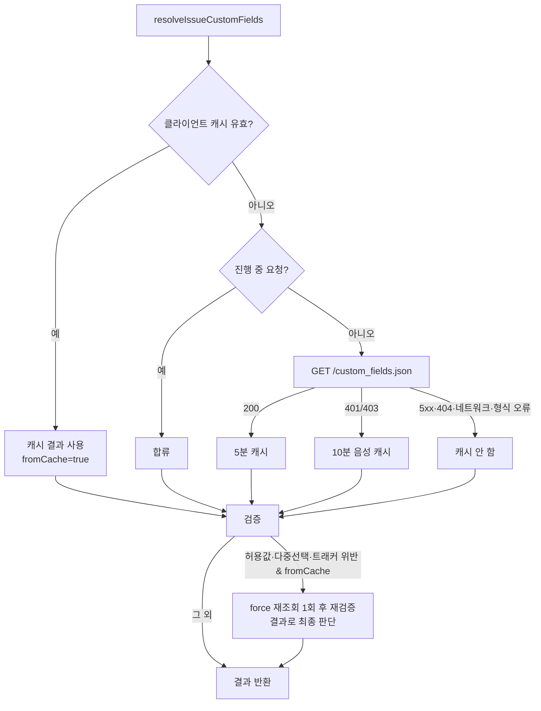

# DL-0036: 커스텀 필드 정의 캐시 (클라이언트 단위 TTL + 거부 전 강제 재조회)

> **안내 (ADR과의 구분 규칙)**: 
> 아키텍처, 인프라, 보안 모델 등 시스템 전반에 큰 영향을 미치는 사항은 **ADR**로 작성하십시오. 
> 본 결정 로그(Decision Log)는 코딩 컨벤션, 라이브러리 단순 교체, 워크플로우 조정, UI/UX 결정 등 **일상적이고 실무적인(Operational) 결정**을 빠르게 기록하고 추적하기 위한 용도입니다.

## 1. 주제 (Topic)
[[DL-0035-issue-custom-field-values|DL-0035]] 의 사전 검증은 `custom_fields` 가 있는 `create_issue`/`update_issue` 호출마다 `GET /custom_fields.json`(관리자 전용)을 부른다.

- 비관리자 키는 매 호출 403 으로 끝나는 요청이 하나씩 더 나간다.
- 관리자 키는 전체 정의(필드당 허용값 최대 1,000개)를 매번 다시 내려받는다.

DL-0035 후속 조치("API 키 단위 짧은 TTL 캐시 검토")를 처리한다.

## 2. 결정 사항 (Decision)

1. **캐시 스코프 = `RedmineClient` 인스턴스**: `src/utils/issue_custom_fields.ts` 의 모듈 내부 `WeakMap<RedmineClient, {result, expiresAt}>`. 클라이언트는 MCP 세션마다 하나(`src/index.ts` `getAuthClient(headers)`; stdio 는 프로세스 수명, HTTP 는 세션별 사용자 키)이므로 API 키별 격리가 자동으로 된다. 클라이언트 클래스는 바꾸지 않는다.
2. **TTL (상수, 환경변수 없음)**
   - 성공(정의 Map): `DEFINITIONS_CACHE_TTL_MS = 300_000`(5분, [[DL-0022-resolver-ttl-cache|SmartNameResolver]] 기본값과 같음)
   - 401/403(권한 없음 → `skippedReason`): `DEFINITIONS_DENIED_TTL_MS = 600_000`(10분)
   - 404·5xx·네트워크 오류·예상외 응답 형식: **캐시하지 않음**(일시 장애가 10분간 검증을 끄지 않도록). 캐시되지 않는 결과가 오면(강제 재조회 결과여도) 기존 엔트리를 **무효화**해 다음 호출이 다시 조회한다.
   - 엔트리 크기 상한: 일감 필드 정의 1,000개, 필드당 허용값 1,000개(기존), regexp 1,024자(안내용으로만 쓰므로 잘라 저장). 상한 밖 정의는 `skipped_checks`(`definition`)로 처리된다.
   - 시간은 `Date.now()` 로 판정해 테스트에서 `vi.useFakeTimers()` 로 제어한다.
3. **동시 호출 병합**: 같은 클라이언트의 진행 중 요청(`WeakMap<RedmineClient, Promise>`)이 있으면 합류한다. 요청이 끝나면(성공·실패 모두) `finally` 에서 자기 자신일 때만 지워, 실패한 promise 가 남지 않는다.
4. **거부 전 1회 강제 재조회**: 캐시된 정의로 검증한 결과 허용값·다중선택·트래커 위반이 있을 때만 `force` 로 다시 조회해 **처음 입력값으로** 재검증하고 그 결과로 최종 판단한다(표준 값 치환도 새 정의 기준, 오래된 정의 결과와 섞지 않음). 재조회는 호출당 최대 1회이며, 이번 호출이 직접 조회한 정의로 거부할 때·일감 적용 불가(`applicableFieldIds`) 오류일 때는 재조회하지 않는다. 재조회가 403/5xx 등으로 실패하면 기존 graceful degradation(`performed: false`, Redmine 422 위임)으로 강등한다.
   - `force` 도 진행 중 요청에는 합류한다. 진행 중 요청은 캐시가 비었거나 만료된 뒤(즉 캐시를 읽은 뒤)에 시작된 것이므로 캐시보다 새롭다.
5. **기존 동작 유지**: `custom_field_validation` 형식·사유 문구, 미리보기에는 캐시 사용 여부를 노출하지 않는다.
6. **프로젝트 필드 목록(`fetchProjectFields`)은 캐시하지 않는다**: 이름 해석 실패가 예외(쓰기 차단)라 같은 방식이면 "필드 추가 직후 오래된 캐시로 Invalid name" 을 막기 위한 재조회 경로가 하나 더 필요하고, 프로젝트별 엔트리라 인스턴스당 메모리 상한도 별도로 둬야 한다. 일반 사용자 권한으로 되는 가벼운 요청이고 `update_issue` 는 상세 조회와 병렬이라 이득이 작아 범위에서 제외한다.

## 3. 이유 (Reasoning)
- **전역(프로세스) 캐시·키 해시 기반 공유 캐시 배제**: `/custom_fields.json` 은 키의 권한(관리자 여부)에 따라 결과가 달라진다. 전역 캐시는 관리자 키로 받은 정의(허용값 목록 등)가 비관리자 세션의 오류 메시지로 새어 나갈 수 있고, 키 해시 맵은 원문 키에서 파생된 값을 프로세스 메모리에 오래 두고 세션이 끝나도 수거되지 않아 별도 상한·만료 관리가 필요하다. 클라이언트 인스턴스는 이미 키 1개에 묶여 있어 WeakMap 만으로 격리·수거·인스턴스당 1엔트리 상한이 보장된다. HTTP 세션 간 공유 이득(같은 키의 다른 세션)은 포기한다.
- **TTL 비대칭**: 정의 변경(허용값 추가)은 실제로 일어나고 거부 오탐을 만들 수 있어 짧게(5분), 권한 상태(관리자 승격)는 드물고 놓쳐도 Redmine 422 가 최종 방어선이라 길게(10분) 잡았다.
- **거부 전 재조회**: 캐시로 인한 위험은 "새로 추가된 허용값·트래커를 오래된 정의로 거부" 하는 오탐뿐이다(통과 쪽 오판은 Redmine 422 가 막는다). 거부 직전에만 재조회하면 정상 경로는 캐시 이득을 그대로 누리면서 오탐을 없앤다.
- **권한 변경 반영 지연 (수용한 위험)**
  - 관리자 권한 박탈: 거부 경로는 강제 재조회가 403 을 받아 검증 생략으로 강등되므로 허용값 목록이 오류로 나가지 않는다. 다만 **통과 경로**는 최대 5분간 캐시된 정의를 써서 `skipped_checks[].regexp` 와 라벨 → 표준 값 치환 결과가 보일 수 있다. 같은 세션이 직전까지 관리자로서 볼 수 있던 데이터이고 세션 내로 한정되므로 수용한다(테스트로 현재 동작 고정).
  - 권한 승격: 최대 10분 사전 검증이 생략된다. 기능 저하일 뿐이며 Redmine 422 와 `create_issue` 의 `custom_fields_not_applied` 경고(조용한 무시 탐지), `update_issue` 의 일감 적용 가능 필드 검사가 최종 방어선이다.
- **오래된 캐시로 잘못 통과 (수용한 위험)**: 재조회는 거부할 때만 하므로, 관리자가 필드를 어떤 트래커에서 끈 직후 5분 안에는 캐시된 정의로 트래커 검사를 통과할 수 있다. Redmine 은 이 값을 422 없이 버리지만 `create_issue` 는 응답 비교로 `custom_fields_not_applied` 를 경고하고, `update_issue` 는 일감 상세의 적용 가능 필드로 먼저 걸러진다. 허용값 삭제는 Redmine 422 가 잡는다. 트래커 지정 시 캐시를 무시하는 방안은 복잡도 대비 이득이 작아 채택하지 않았다.
- **R2 리뷰 반영**: 강제 재조회 실패(5xx·네트워크·형식 오류) 강등·캐시 무효화, 동시 거부의 재조회 병합, 강제 재조회 in-flight 실패 정리 테스트 추가(deep L4), 엔트리 크기 상한(security L3), 권한 박탈 후 통과 경로 동작 고정 테스트(security L1), 주석 정확도(deep L2·L3), `mcp_tools_spec` 반영(deep M2).

## 4. 후속 조치 (Action Items)
- [x] `src/utils/issue_custom_fields.ts` 에 클라이언트 단위 캐시·in-flight 병합·거부 전 강제 재조회 구현
- [x] `tests/unit/issue_custom_fields.test.ts` 에 캐시 적중, TTL 만료, 401/403 음성 캐시, 5xx·404·네트워크·형식 오류 미캐시, 동시 호출 병합·실패 정리, 인스턴스 격리, 강제 재조회(통과·재거부·트래커·다중선택·강등) 테스트 추가
- [ ] 프로젝트 필드 목록 캐시가 필요해지면 이름 해석 실패 시 재조회 경로와 프로젝트별 엔트리 상한을 함께 설계
