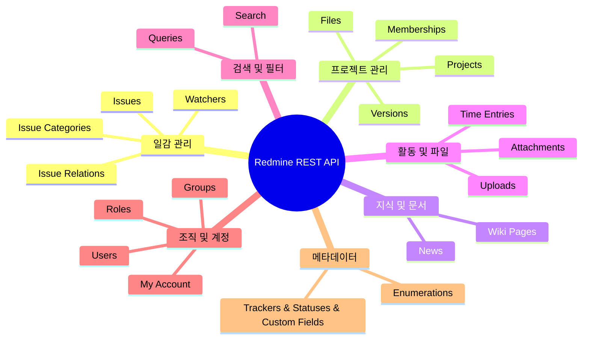
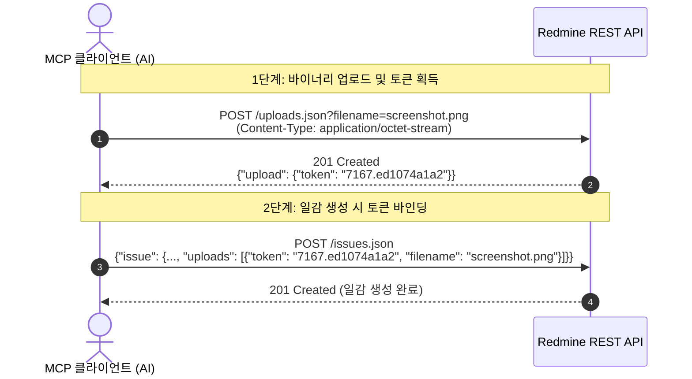

# Redmine 공식 REST API 100% 전수 명세서 및 MCP 연동 가이드

> [!abstract] 문서 개요
> - **목적**: Redmine 공식 REST API의 **21개 전체 도메인**을 누락 없이 정리하여, MCP(Model Context Protocol) 서버 개발 시 신뢰할 수 있는 단일 기술 레퍼런스(Single Source of Truth)로 활용.
> - **연계 문서**: 프로젝트 비교 및 아키텍처 전략은 [[redmine_mcp_research|Redmine MCP 생태계 조사 및 분석 보고서]]를 참조하십시오.
> - **호환성**: Redmine 1.0부터 6.x / 7.x 최신 버전까지의 호환성 및 OpenAPI 3.0 스펙 반영.

---

## 1. 전수 API 리소스 색인 (21개 도메인)



| 도메인 | 리소스 명칭 | 공식 엔드포인트 | 메서드 | 최소 지원 버전 |
|---|---|---|:---:|:---:|
| **일감 관리** | 1. 일감 (Issues) | `/issues.json`, `/issues/{id}.json` | GET, POST, PUT, DELETE | 1.0+ |
| | 2. 일감 관계 (Relations) | `/issues/{issue_id}/relations.json`, `/relations/{id}.json` | GET, POST, DELETE | 1.3+ |
| | 3. 관찰자 (Watchers) | `/issues/{id}/watchers.json`, `/issues/{id}/watchers/{user_id}.json` | POST, DELETE | 2.3+ |
| | 4. 일감 범주 (Categories) | `/projects/{project_id}/issue_categories.json`, `/issue_categories/{id}.json` | GET, POST, PUT, DELETE | 1.3+ |
| **프로젝트** | 5. 프로젝트 (Projects) | `/projects.json`, `/projects/{id}.json` | GET, POST, PUT, DELETE | 1.0+ |
| | 6. 버전/마일스톤 (Versions) | `/projects/{project_id}/versions.json`, `/versions/{id}.json` | GET, POST, PUT, DELETE | 1.3+ |
| | 7. 멤버십 (Memberships) | `/projects/{project_id}/memberships.json`, `/memberships/{id}.json` | GET, POST, PUT, DELETE | 1.4+ |
| | 8. 프로젝트 파일 (Files) | `/projects/{project_id}/files.json` | GET, POST | 3.4+ |
| **지식/문서** | 9. 위키 페이지 (Wiki) | `/projects/{project_id}/wiki/index.json`, `/projects/{project_id}/wiki/{title}.json` | GET, PUT, DELETE | 2.2+ |
| | 10. 공지사항 (News) | `/news.json`, `/projects/{project_id}/news.json` | GET, POST | 1.1+ |
| **활동/파일** | 11. 시간 기록 (Time Entries) | `/time_entries.json`, `/time_entries/{id}.json` | GET, POST, PUT, DELETE | 1.1+ |
| | 12. 첨부파일 (Attachments) | `/attachments/{id}.json`, `/attachments/download/{id}/{filename}` | GET, DELETE | 1.3+ |
| | 13. 파일 업로드 (Uploads) | `/uploads.json` | POST | 1.4+ |
| **검색/필터** | 14. 통합 검색 (Search) | `/search.json` | GET | 3.3+ |
| | 15. 저장된 필터 (Queries) | `/queries.json` | GET | 1.3+ |
| **조직/계정** | 16. 사용자 (Users) | `/users.json`, `/users/{id}.json`, `/users/current.json` | GET, POST, PUT, DELETE | 1.1+ |
| | 17. 내 계정 (My Account) | `/my/account.json` | GET | 4.1+ |
| | 18. 그룹 (Groups) | `/groups.json`, `/groups/{id}.json`, `/groups/{id}/users.json` | GET, POST, PUT, DELETE | 2.1+ |
| | 19. 역할 및 권한 (Roles) | `/roles.json`, `/roles/{id}.json` | GET | 1.4+ |
| **메타데이터** | 20. 열거형 (Enumerations) | `/enumerations/issue_priorities.json`<br>`/enumerations/time_entry_activities.json`<br>`/enumerations/document_categories.json` | GET | 2.2+ |
| | 21. 시스템 메타 | `/trackers.json`, `/issue_statuses.json`, `/custom_fields.json` | GET | 1.3+ / 2.4+ |

---

## 2. 공통 통신 프로토콜 및 주의사항

> [!important] 필수 공통 규격
> 1. **URL 형식**: 모든 경로 뒤에 `.json`을 명시합니다. (`GET /issues.json`)
> 2. **인증 헤더**:
>    - `X-Redmine-API-Key: <api_key>` (가장 권장)
>    - `Authorization: Basic <Base64(username:password)>`
>    - `Authorization: Bearer <oauth2_token>` (Redmine 6.1+)
> 3. **헤더 규칙**: `POST`/`PUT` 요청 시 `Content-Type: application/json` 지정 필수.

> [!warning] HTTP 204 No Content 파싱 주의 (Gotcha)
> Redmine은 `PUT /issues/{id}.json` 등 일감 수정 요청 성공 시 **본문 없이 `HTTP 204 No Content`**를 반환합니다. 클라이언트에서 무조건 `response.json()`을 호출하면 `JSONDecodeError` 또는 파싱 예외가 발생하므로, 상태 코드가 204인 경우 빈 객체(`{}`)를 반환하도록 예외 처리해야 합니다.

---

## 3. 도메인별 상세 명세

---

### [도메인 1] 일감 관리 (Issues, Relations, Watchers, Categories)

#### 1. 일감 목록 조회 (`GET /issues.json`)
* **쿼리 파라미터**:
  * `project_id`: 프로젝트 식별자/숫자 ID
  * `subproject_id`: 하위 프로젝트 (`*` 포함, `!*` 제외)
  * `tracker_id`: 트래커 ID
  * `status_id`: `open`(기본값), `closed`, `*`(전체), 또는 상태 숫자 ID
  * `assigned_to_id`: 담당자 ID (`me`=현재 사용자)
  * `author_id`: 작성자 ID (`me`=현재 사용자)
  * `subject`: 제목 키워드 검색 (`~키워드`)
  * `created_on`, `updated_on`, `due_date`: 날짜 필터 (예: `>=2026-09-01`, `><2026-09-01|2026-09-18`)
  * `sort`: 정렬 (예: `updated_on:desc,priority:desc`)
  * `include`: 부가 정보 (`attachments,relations,subtasks`)

#### 2. 일감 상세 조회 (`GET /issues/{id}.json`)
* **파라미터**: `include=children,attachments,relations,changesets,journals,watchers,allowed_statuses`

> [!tip] `allowed_statuses` 필드의 중요성
> 상세 조회 시 `include=allowed_statuses`를 전달하면, 현재 워크플로우 상 **해당 일감이 전이할 수 있는 유효 상태 목록**만 반환됩니다. LLM이 워크플로우에 없는 상태로 변경을 시도하여 422 에러가 발생하는 것을 원천 차단할 수 있습니다.

#### 3. 일감 생성 (`POST /issues.json`)
```json
{
  "issue": {
    "project_id": 1,
    "tracker_id": 1,
    "status_id": 1,
    "priority_id": 4,
    "subject": "로그인 버튼 레이아웃 깨짐",
    "description": "사파리 브라우저에서 버튼 위치가 우측으로 밀림",
    "assigned_to_id": 5,
    "category_id": 2,
    "fixed_version_id": 3,
    "parent_issue_id": 1000,
    "start_date": "2026-09-18",
    "due_date": "2026-09-25",
    "estimated_hours": 4.5,
    "done_ratio": 0,
    "custom_fields": [{"id": 1, "value": "운영"}],
    "watcher_user_ids": [5, 12],
    "uploads": [
      {
        "token": "7167.ed1074a1a24e",
        "filename": "screenshot.png",
        "content_type": "image/png"
      }
    ]
  }
}
```

#### 4. 일감 수정 및 댓글 작성 (`PUT /issues/{id}.json`)
```json
{
  "issue": {
    "status_id": 3,
    "done_ratio": 100,
    "notes": "작업 완료했습니다. 검토 부탁드립니다.",
    "private_notes": false
  }
}
```

#### 5. 일감 관계 (Issue Relations API)
* **목록 조회**: `GET /issues/{issue_id}/relations.json`
* **관계 생성**: `POST /issues/{issue_id}/relations.json`
  ```json
  {
    "relation": {
      "issue_to_id": 1050,
      "relation_type": "blocks",
      "delay": 0
    }
  }
  ```
  * `relation_type`: `relates`, `duplicates`, `duplicated`, `blocks`, `blocked`, `precedes`, `follows`, `copied_to`, `copied_from`
* **관계 삭제**: `DELETE /relations/{id}.json`

#### 6. 일감 관찰자 (Watchers API)
* **관찰자 추가**: `POST /issues/{id}/watchers.json` (`{"user_id": 12}`)
* **관찰자 제거**: `DELETE /issues/{id}/watchers/{user_id}.json`

#### 7. 일감 범주 (Issue Categories API)
* **목록/상세**: `GET /projects/{project_id}/issue_categories.json`, `GET /issue_categories/{id}.json`
* **생성**: `POST /projects/{project_id}/issue_categories.json` (`{"issue_category": {"name": "UI/UX", "assigned_to_id": 5}}`)
* **수정/삭제**: `PUT /issue_categories/{id}.json`, `DELETE /issue_categories/{id}.json?reassign_to_id=2`

---

### [도메인 2] 프로젝트 및 버전 관리 (Projects, Versions, Memberships, Files)

#### 1. 프로젝트 (Projects API)
* **목록**: `GET /projects.json?include=trackers,issue_categories,enabled_modules`
* **상세**: `GET /projects/{id}.json?include=trackers,issue_categories,enabled_modules,time_entry_activities,issue_custom_fields`
* **생성**: `POST /projects.json`
  ```json
  {
    "project": {
      "name": "모바일 앱 리뉴얼",
      "identifier": "mobile-app-v2",
      "description": "2026 모바일 앱 리뉴얼",
      "is_public": false,
      "parent_id": 1,
      "inherit_members": true,
      "tracker_ids": [1, 2, 3]
    }
  }
  ```
* **수정/아카이브/삭제**: `PUT /projects/{id}.json`, `PUT /projects/{id}/archive.json`, `DELETE /projects/{id}.json`

#### 2. 버전 및 마일스톤 (Versions API)
* **목록/상세**: `GET /projects/{project_id}/versions.json`, `GET /versions/{id}.json`
* **생성**: `POST /projects/{project_id}/versions.json`
  ```json
  {
    "version": {
      "name": "v1.2.0 배포",
      "status": "open",
      "sharing": "none",
      "due_date": "2026-10-15",
      "description": "로그인 및 결제 기능 안정화"
    }
  }
  ```
  * `status`: `open`(진행중), `locked`(추가불가), `closed`(종료)
  * `sharing`: `none`, `descendants`, `hierarchy`, `tree`, `system`
* **수정/삭제**: `PUT /versions/{id}.json`, `DELETE /versions/{id}.json`

#### 3. 프로젝트 멤버십 (Memberships API)
* **목록/상세**: `GET /projects/{project_id}/memberships.json`, `GET /memberships/{id}.json`
* **멤버 추가**: `POST /projects/{project_id}/memberships.json` (`{"membership": {"user_id": 15, "role_ids": [3, 4]}}`)
* **역할 수정/제외**: `PUT /memberships/{id}.json`, `DELETE /memberships/{id}.json`

#### 4. 프로젝트 파일 (Files API)
* **목록**: `GET /projects/{project_id}/files.json`
* **등록**: `POST /projects/{project_id}/files.json` (`{"file": {"token": "...", "version_id": 3, "description": "릴리즈 zip"}}`)

---

### [도메인 3] 지식 및 공지 관리 (Wiki Pages & News)

#### 1. 위키 페이지 (Wiki Pages API)
* **위키 목차**: `GET /projects/{project_id}/wiki/index.json`
* **위키 상세**: `GET /projects/{project_id}/wiki/{title}.json?include=attachments`
* **특정 버전 조회**: `GET /projects/{project_id}/wiki/{title}/{version}.json`
* **위키 생성/수정**: `PUT /projects/{project_id}/wiki/{title}.json`
  ```json
  {
    "wiki_page": {
      "text": "h1. 시스템 아키텍처\n\n본 시스템은 MSA 구조로 설계되었습니다...",
      "comments": "인프라 다이어그램 섹션 추가",
      "version": 3
    }
  }
  ```
* **삭제**: `DELETE /projects/{project_id}/wiki/{title}.json`

#### 2. 공지사항 (News API)
* **목록/상세**: `GET /news.json`, `GET /projects/{project_id}/news.json`
* **등록**: `POST /projects/{project_id}/news.json` (`{"news": {"title": "점검 공지", "summary": "...", "description": "..."}}`)

---

### [도메인 4] 활동 및 파일 (Time Entries & Attachments)

#### 1. 작업 시간 기록 (Time Entries API)
* **목록**: `GET /time_entries.json` (필터: `issue_id`, `project_id`, `user_id`, `spent_on`, `from`, `to`)
* **등록**: `POST /time_entries.json`
  ```json
  {
    "time_entry": {
      "issue_id": 1024,
      "spent_on": "2026-09-18",
      "hours": 2.5,
      "activity_id": 9,
      "comments": "사파리 CSS 버그 수정"
    }
  }
  ```
* **수정/삭제**: `PUT /time_entries/{id}.json`, `DELETE /time_entries/{id}.json`

#### 2. 2단계 파일 첨부 메커니즘 (Attachments & Uploads)



* **첨부 메타데이터 조회**: `GET /attachments/{id}.json`
* **첨부 다운로드**: `GET /attachments/download/{id}/{filename}`
* **첨부 삭제**: `DELETE /attachments/{id}.json`

---

### [도메인 5] 검색 및 필터 (Search & Queries)

#### 1. 통합 검색 (Search API)
* `GET /search.json?q={keyword}&scope=all|my_projects|subprojects&issues=1&wiki_pages=1&open_issues=1`

#### 2. 저장된 필터 (Queries API)
* `GET /queries.json`: Redmine 웹에서 정의된 커스텀 쿼리 목록 조회 → `GET /issues.json?query_id={id}`로 활용.

---

### [도메인 6] 조직 및 계정 관리 (Users, Groups, Roles, My Account)

* **사용자 CRUD**: `GET /users.json`, `GET /users/{id}.json`, `POST /users.json`, `PUT /users/{id}.json`, `DELETE /users/{id}.json`
* **내 계정 정보**: `GET /my/account.json` 또는 `GET /users/current.json`
* **그룹 CRUD**: `GET /groups.json`, `POST /groups.json`, `POST /groups/{id}/users.json`, `DELETE /groups/{id}/users/{user_id}.json`
* **역할 및 권한**: `GET /roles.json`, `GET /roles/{id}.json` (역할별 세부 `permissions` 반환)

---

### [도메인 7] 메타데이터 및 열거형 (Enumerations & Metadata)

> [!note] Smart Name Resolver 캐싱 대상
> LLM이 문자열 이름으로 요청할 수 있도록 초기화 시 메모리에 로드해야 할 리소스입니다.

| 엔드포인트 | 반환 데이터 | 캐싱 목적 |
|---|---|---|
| `GET /trackers.json` | 트래커 목록 (결함, 개선 등) | 트래커 이름 ↔ ID 매핑 |
| `GET /issue_statuses.json` | 일감 상태 목록 (신규, 진행, 완료 등) | 상태 이름 ↔ ID 매핑 |
| `GET /enumerations/issue_priorities.json` | 우선순위 (낮음, 보통, 긴급 등) | 우선순위 이름 ↔ ID 매핑 |
| `GET /enumerations/time_entry_activities.json` | 작업 시간 활동 유형 (설계, 개발 등) | 작업 유형 ↔ ID 매핑 |
| `GET /enumerations/document_categories.json` | 문서 범주 | 문서/첨부 분류 매핑 |
| `GET /custom_fields.json` | 커스텀 필드 스키마 | 사내 필수 필드 기본값 및 유효성 검증 |

---

#redmine #rest-api #mcp #api-specification
