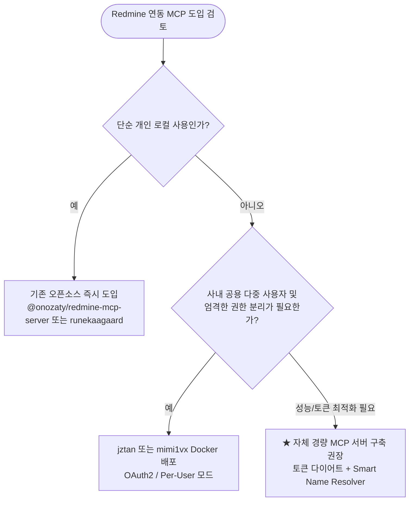
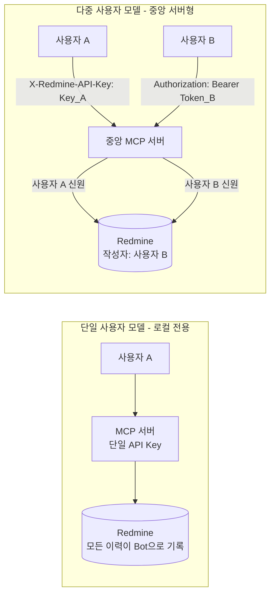

# Redmine MCP 서버 오픈소스 생태계 조사 및 라이선스/인증 분석 보고서

> [!abstract] 핵심 요약
> - **목적**: Redmine과 AI 에이전트(Claude Desktop, Cursor 등) 연동을 위한 MCP(Model Context Protocol) 서버 구축 전, 기존 오픈소스 프로젝트(11종)의 기능, 라이선스, 인증 방식, 다중 사용자 지원 여부를 전수 분석.
> - **연계 문서**: 세부 API 규격은 [[redmine_api_specification|Redmine 공식 REST API 100% 전수 명세서]]를 참조하십시오.
> - **핵심 결론**: 기존 오픈소스는 **도구 수 과다(Tool Bloat)**와 **숫자 ID 강제**로 인한 비효율이 존재하므로, **TypeScript 기반 핵심 도구(5~7개) 압축 + Smart Name Resolver(이름↔ID 자동 매핑)**를 갖춘 자체 경량 MCP 서버 구축을 권장.

---

## 1. 개요 및 목적

본 문서는 Redmine과 AI 도구를 연동하는 MCP 서버를 구현하기 전, 다음 4가지 핵심 질문에 답하기 위해 작성되었습니다:

1. **기존 오픈소스를 그대로 활용할 수 있는가?** (바퀴의 재발명 방지)
2. **다중 사용자(Multi-User) 환경과 보안 감사(Audit Trail)를 충족하는가?**
3. **각 프로젝트의 라이선스 제약(MIT, Apache, MPL, GPL)과 소스코드 차용 가능 범위는 어떠한가?**
4. **자체 구축 시 벤치마킹할 핵심 아키텍처 및 차별화 요소는 무엇인가?**

---

## 2. 오픈소스 Redmine MCP 프로젝트 종합 비교표

| 프로젝트명 | 언어 / 런타임 | 전송 방식 | 지원 인증 방식 | **다중 사용자 (Multi-User)** | 라이선스 | 소스코드 재사용성 |
|:---|:---|:---|:---|:---:|:---:|:---:|
| **[jztan/redmine-mcp-server](https://github.com/jztan/redmine-mcp-server)** | Python (FastMCP) | HTTP / Docker | • API Key • Basic Auth (ID/PW) • **OAuth2 (RFC 7662)** • **Per-User API Key** • **mTLS (클라이언트 인증서)** | **지원 (완벽)** (요청별 신원 분리) | **MIT** | **자유로움** (출처 표기) |
| **[mimi1vx/ruprogress-mcp](https://github.com/mimi1vx/ruprogress-mcp)** | Rust | stdio & HTTP | • API Key • **OAuth2 (RFC 7662)** • **OAuth-Proxy (PKCE)** • **Per-User API Key** • mTLS / Custom CA | **지원 (완벽)** (요청별 신원 분리) | **MIT** | **자유로움** (출처 표기) |
| **[joaoperfig/redmine_mcp_plugin](https://github.com/joaoperfig/redmine_mcp_plugin)** | Ruby on Rails (플러그인) | HTTP (`/mcp`) | • **Redmine 세션 쿠키** • API Key • OAuth2 Bearer 토큰 | **지원 (네이티브)** (Redmine 권한 모델) | **GPL-2.0+** | **엄격함** (전체코드 공개) |
| **[@onozaty/redmine-mcp-server](https://github.com/onozaty/redmine-mcp-server)** | TypeScript (Node) | stdio (`npx`) / Docker | • API Key (`REDMINE_API_KEY`) | **미지원** (단일 고정 API Key) | **MIT** | **자유로움** (출처 표기) |
| **[aarondpn/redmine-cli](https://github.com/aarondpn/redmine-cli)** | Go | stdio (CLI 내장) | • API Key • Basic Auth (ID/PW) | **미지원** (단일 계정 설정) | **MIT** | **자유로움** (출처 표기) |
| **[@gmlee-ncurity/mcp-server-redmine](https://github.com/gmlee-ncurity/mcp-server-redmine)** | TypeScript (Node) | stdio (`npx`) | • API Key • Basic Auth (ID/PW) | **미지원** (단일 계정 환경변수) | **Apache-2.0** | **자유로움** (특허보호/수정명시) |
| **[runekaagaard/mcp-redmine](https://github.com/runekaagaard/mcp-redmine)** | Python (`httpx`, `uv`) | stdio (`uvx`) | • API Key (`REDMINE_API_KEY`) | **미지원** (단일 고정 API Key) | **MPL-2.0** | **주의 필요** (수정 파일 공개) |
| **[yonaka15/redmine-mcp](https://github.com/yonaka15/redmine-mcp)** | Rust + React (Tauri) | HTTP (Axum) | • API Key (GUI 테스트/암호화 저장) | **미지원** (로컬 단일 사용자 UI) | **MIT** | **자유로움** (출처 표기) |
| **[andrelaptenok/redmine-mcp-stdio](https://github.com/andrelaptenok/redmine-mcp-stdio)** | TypeScript | stdio | • API Key | **미지원** (단일 계정 환경변수) | **MIT** | **자유로움** (출처 표기) |
| **[zacharyelston/redmine-mcp-server](https://github.com/zacharyelston/redmine-mcp-server)** | TypeScript / Flask | stdio / Docker | • API Key | **미지원** (단일 계정 환경변수) | **MIT** | **자유로움** (출처 표기) |
| **[snowild/redmine-mcp](https://github.com/snowild/redmine-mcp)** | Python | stdio | • API Key | **미지원** (단일 계정 환경변수) | **MIT** | **자유로움** (출처 표기) |

---

## 3. 다중 사용자(Multi-User) 지원 및 인증 아키텍처 분석

> [!important] 다중 사용자 분리의 중요성 (Audit Trail & RBAC)
> 사내 중앙 서버에 단일 사용자용 MCP 서버를 배포하고 여러 팀원이 함께 사용할 경우:
> 1. 모든 일감 생성/수정/시간기록이 **단 1개의 서비스 봇 계정으로 기록**되어 **책임 소재 추적(Audit Trail)**이 불가능해집니다.
> 2. Redmine의 역할 기반 권한(RBAC)이 무시되어, **비공개 프로젝트나 민감 티켓의 내용이 권한 없는 사용자에게 AI를 통해 누출**될 위험이 발생합니다.

### 1) 사용자 격리 모델 비교

### 2) 다중 사용자 구현 4대 메커니즘
1. **Per-User API Key 헤더 위임 (`jztan`, `mimi1vx`)**:
   * 클라이언트 요청 헤더(`X-Redmine-API-Key`)에 각 사용자의 고유 API 키를 주입받아 동적으로 Redmine 호출.
   * `REDMINE_PER_USER_AUDIT_IDENTITY=true`로 요청마다 User ID를 검증 및 로깅.
2. **OAuth2 RFC 7662 토큰 인트로스펙션 (`jztan`, `mimi1vx`)**:
   * Redmine 6.1+ Doorkeeper 연동. 클라이언트의 Bearer 토큰 유효성과 스코프를 검증.
3. **OAuth-Proxy 패턴 (`jztan`, `mimi1vx`)**:
   * MCP 서버가 자체적으로 RFC 7591 DCR(동적 클라이언트 등록) 및 PKCE 인가 프록시로 동작.
4. **Redmine 네이티브 웹 세션 연동 (`joaoperfig/redmine_mcp_plugin`)**:
   * Redmine 내부에 설치되는 플러그인으로, 브라우저 세션 쿠키를 그대로 활용하여 Redmine의 네이티브 권한을 100% 적용.

---

## 4. 라이선스별 소스 코드 활용 및 재사용 가이드

> [!note] 라이선스 준수 가이드
> - **MIT / Apache-2.0 프로젝트**: 소스코드를 복사, 수정, 사내 비공개 프로젝트에 결합해도 법적으로 완전히 안전합니다 (원저작권 고지만 유지).
> - **MPL-2.0 프로젝트**: 원본 파일을 수정한 경우 해당 파일의 수정본을 공개해야 합니다 (별도 파일로 모듈 분리 시 안전).
> - **GPL-2.0+ 프로젝트**: 해당 코드를 가져다 파생 저작물을 만들면 전체 코드가 GPL로 공개되어야 합니다.

* **TypeScript 개발 시 권장 레퍼런스**: `@onozaty/redmine-mcp-server` (MIT)의 API 클라이언트 구조 및 `@gmlee-ncurity/mcp-server-redmine` (Apache-2.0)
* **스마트 리졸버 및 CLI 구조 레퍼런스**: `aarondpn/redmine-cli` (MIT)
* **안전 장치 및 스키마 변환 레퍼런스**: `mimi1vx/ruprogress-mcp` (MIT)

---

## 5. 기존 프로젝트들의 공통적인 한계 및 차별화 기회 (Gap Analysis)

> [!warning] 기존 Redmine MCP 도구들의 공통적 페인포인트
> 1. **도구 수 과다(Tool Bloat)**: 40~60개 도구가 노출되어 프롬프트 토큰이 수천 개씩 낭비되고 LLM 환각률 증가.
> 2. **숫자 ID 강제**: `tracker_id`, `status_id`, `project_id` 등 숫자 ID를 요구하여 LLM이 사전 조회 턴을 낭비함.
> 3. **본문 서식 불일치**: LLM은 Markdown을 생성하지만, Redmine 인스턴스가 Textile인 경우 서식이 완전히 깨짐.
> 4. **사내 필수 커스텀 필드 에러**: 누락 시 422 에러 발생 빈번.

---

## 6. 결론 및 자체 프로젝트 개발 권장 아키텍처

> [!tip] 자체 구축 시 권장 설계 스펙
> 1. **기술 스택**: TypeScript + `@modelcontextprotocol/sdk` (Node.js / Bun)
> 2. **핵심 도구 압축 (5~7개)**:
>    - `search_issues` (자연어 및 필터 검색)
>    - `get_issue` (본문, 댓글, 첨부, allowed_statuses 통합 반환)
>    - `create_issue` (이름 기반 스마트 생성)
>    - `update_issue` (상태 변경, 진척도, 댓글 추가)
>    - `log_time` (작업 시간 기록)
>    - `get_meta` (프로젝트/트래커/상태 캐싱)
> 3. **Smart Name Resolver**:
>    - 서버 시작 시 트래커/상태/우선순위/담당자를 인메모리 캐싱하여 `"tracker": "결함"`, `"status": "진행중"` 문자열을 자동으로 숫자 ID로 치환.
> 4. **Markdown ↔ Textile 자동 변환 계층**: Redmine 텍스트 서식에 따라 투명하게 상호 변환.
> 5. **다중 사용자 확장성**:
>    - 단일 로컬 모드(`REDMINE_API_KEY`)와 요청별 컨텍스트 헤더(`X-Redmine-API-Key`) 위임 모드를 모두 지원하는 구조 설계.

---

#redmine #mcp #architecture #license
