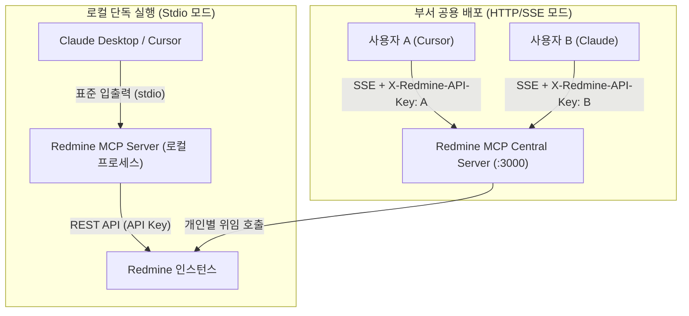

# Redmine MCP 서버 설정 및 클라이언트 연동 가이드

> [!abstract] 문서 개요
> 본 문서는 **Redmine MCP(Model Context Protocol) 서버**의 설치, 빌드, 환경 설정 및 대표적인 LLM 클라이언트(**Claude Desktop**, **Cursor IDE**)와의 연동 절차를 안내합니다.
> 개인 PC에서 실행하는 **단일 사용자 표준 입출력(Stdio)** 방식과 부서 단위로 공용 운영하는 **HTTP 서버-전송 이벤트(SSE)** 방식을 모두 지원합니다.

---

## 1. 아키텍처 및 연결 방식

본 MCP 서버는 두 가지 전송(Transport) 모드를 지원합니다. 사용 환경에 맞추어 적절한 방식을 선택하십시오.



* **Stdio 모드**: 로컬 데스크톱 애플리케이션(Claude Desktop, Cursor)이 MCP 서버 프로세스를 직접 자식 프로세스로 구동하여 통신합니다. (개인 로컬용)
* **HTTP/SSE 모드**: 중앙 서버에 상시 구동해 두고, 부서원들이 네트워크를 통해 연결합니다. 클라이언트 요청 헤더(`X-Redmine-API-Key`)를 통해 사용자별 권한을 위임 처리합니다. (부서 공용)

자세한 내부 구조는 [[architecture_design|아키텍처 설계서]]를 참조하십시오.

---

## 2. 사전 준비 사항 (Prerequisites)

### 2.1. 필수 런타임
* **Node.js**: v18.0.0 이상 (v20+ 권장)
* **npm**: v9.0.0 이상

### 2.2. Redmine 인스턴스 설정
MCP 서버가 Redmine REST API와 정상 통신하려면 Redmine 관리자 권한으로 REST API가 활성화되어 있어야 합니다.

> [!important] Redmine REST API 활성화 (관리자 설정)
> 1. Redmine 관리자 계정으로 로그인합니다.
> 2. **관리(Administration) > 설정(Settings) > API 탭**으로 이동합니다.
> 3. **`REST 웹 서비스 활성화(Enable REST web service)`** 체크박스를 활성화하고 저장합니다.

### 2.3. 개인 API 접근 키(API Key) 발급
1. Redmine 상단 메뉴의 **내 계정(My account)**을 클릭합니다.
2. 우측 사이드바의 **API 접근 키(API access key)** 섹션에서 **보기(Show)**를 클릭하거나 새로 생성합니다.
3. 생성된 40자리 해시 문자열 키를 복사해 둡니다.

---

## 3. 서버 설치 및 빌드

저장소를 클론한 후 의존성을 설치하고 TypeScript 소스 코드를 빌드합니다.

```bash
# 1. 의존성 패키지 설치
npm install

# 2. TypeScript 컴파일 (dist 디렉토리 생성)
npm run build
```

빌드가 완료되면 `dist/index.js` 파일이 생성됩니다.

---

## 4. 환경 변수 설정 (`.env`)

프로젝트 루트 디렉토리에 `.env` 파일을 생성하거나 환경 변수를 주입합니다.

```env
# 필수: Redmine 인스턴스 기본 URL (끝의 슬래시는 자동으로 정리됨)
REDMINE_URL=https://redmine.your-domain.com

# 필수(Stdio 모드): 기본 Redmine 사용자 API Key
REDMINE_API_KEY=your_redmine_api_key_here

# 선택: 전송 모드 설정 ('stdio' 또는 'sse', 기본값: 'stdio')
TRANSPORT=stdio

# 선택: SSE 모드 실행 시 바인딩할 포트 (기본값: 3000)
PORT=3000
```

> [!warning] 보안 주의사항
> `.env` 파일에는 개인 API 키 등 민감 정보가 포함되므로 Git 저장소에 커밋되지 않도록 `.gitignore`에 등록되어 있는지 항상 확인하십시오.

---

## 5. Claude Desktop 연동 가이드 (Stdio 모드)

Claude Desktop 앱에서 로컬 MCP 서버를 등록하여 대화 창에서 Redmine 일감 및 프로젝트를 직접 조회할 수 있습니다.

### 5.1. 설정 파일 경로
운영체제별 Claude Desktop 설정 파일(`claude_desktop_config.json`)의 위치는 다음과 같습니다.

* **macOS**: `~/Library/Application Support/Claude/claude_desktop_config.json`
* **Windows**: `%APPDATA%\Claude\claude_desktop_config.json`

### 5.2. 설정 구성 (`claude_desktop_config.json`)
설정 파일을 열고 `mcpServers` 블록에 `redmine` 항목을 추가합니다.

```json
{
  "mcpServers": {
    "redmine": {
      "command": "node",
      "args": [
        "/Users/username/workspace/redmini-mcp-prj/dist/index.js"
      ],
      "env": {
        "REDMINE_URL": "https://redmine.your-domain.com",
        "REDMINE_API_KEY": "your_personal_api_key",
        "TRANSPORT": "stdio"
      }
    }
  }
}
```

> [!tip] 개발 모드 (소스 직접 실행)
> 빌드 과정 없이 `tsx`를 통해 소스 코드를 직접 실행하려면 다음과 같이 설정할 수도 있습니다:
> ```json
> {
>   "command": "npx",
>   "args": [
>     "-y",
>     "tsx",
>     "/Users/username/workspace/redmini-mcp-prj/src/index.ts"
>   ]
> }
> ```

### 5.3. 연동 확인
1. Claude Desktop 앱을 완전히 종료 후 다시 시작합니다 (`Cmd + Q` / `Alt + F4`).
2. 대화 입력창 하단에 **망치(도구) 아이콘**이 표시되는지 확인합니다.
3. 아이콘을 클릭하여 다음 4개의 도구가 등록되어 있는지 확인합니다:
   - `search_issues`: 일감 검색
   - `get_issue_details`: 일감 상세 정보 및 이력 조회
   - `get_projects`: 프로젝트 목록 조회
   - `ping`: 서버 연결 상태 확인

---

## 6. Cursor IDE 연동 가이드

Cursor IDE는 에이전트 모드 및 채팅 환경에서 MCP 도구를 완벽히 지원합니다.

### 6.1. Stdio 방식으로 연동하기
1. Cursor를 실행하고 **Settings (Cmd + , 또는 설정 아이콘)**를 엽니다.
2. **Features > MCP Servers** 메뉴로 이동합니다.
3. **+ Add New MCP Server** 버튼을 클릭합니다.
4. 아래와 같이 필드를 입력합니다:
   - **Name**: `redmine`
   - **Type**: `command`
   - **Command**: `node /절대경로/redmini-mcp-prj/dist/index.js`
5. 환경 변수는 실행 쉘의 환경 변수나 Cursor 전역 설정에 `REDMINE_URL`과 `REDMINE_API_KEY`를 등록하거나, 아래 래퍼 스크립트를 지정할 수 있습니다.

### 6.2. SSE(HTTP) 방식으로 연동하기 (권장)
부서 공용 서버가 운영 중이거나 로컬에서 SSE 서버를 기동해 둔 경우:

1. **Features > MCP Servers > + Add New MCP Server** 클릭.
2. 아래와 같이 설정합니다:
   - **Name**: `redmine-sse`
   - **Type**: `sse`
   - **URL**: `http://localhost:3000/mcp/sse` (또는 사내 공용 서버 주소)
   - **Headers** (선택 사항):
     ```json
     {
       "X-Redmine-API-Key": "your_personal_api_key"
     }
     ```
3. 저장 후 초록색 연결 표시(Connected)가 뜨는지 확인합니다.

---

## 7. 부서 공용 SSE 서버 배포 가이드 (Multi-User)

부서원들이 공용으로 사용할 수 있도록 상시 가동형 중앙 서버로 배포하는 절차입니다.

### 7.1. 서버 실행
```bash
# 환경 변수와 함께 SSE 전송 모드로 기동
TRANSPORT=sse PORT=3000 REDMINE_URL=https://redmine.your-domain.com node dist/index.js
```

기동 시 표준 에러(stderr)에 아래와 같은 로그가 출력됩니다:
```text
Redmine MCP Server is running on SSE mode at http://localhost:3000
```

### 7.2. PM2를 이용한 프로세스 데몬 관리 (운영 권장)
서버 장애 시 자동 재기동 및 로그 관리를 위해 PM2 사용을 권장합니다.

```bash
# PM2 설치 (글로벌)
npm install -g pm2

# MCP 서버 기동
pm2 start dist/index.js --name "redmine-mcp" --env TRANSPORT="sse",PORT=3000,REDMINE_URL="https://redmine.your-domain.com"

# 부팅 시 자동 실행 등록
pm2 save
pm2 startup
```

### 7.3. 다중 사용자 권한 위임 동작 원리
* SSE 연결 시 클라이언트가 HTTP 헤더로 `X-Redmine-API-Key`를 전송합니다.
* 서버 내부의 `getAuthClient` 미들웨어는 해당 요청 세션에 해당 사용자의 API 키를 바인딩하여 Redmine API를 대리 호출합니다.
* 따라서 Redmine 일감 조회 내역 및 권한 제어(비공개 프로젝트, 접근 가능 일감 등)가 **해당 사용자 본인의 권한**으로 정확히 제한됩니다.
* 헤더가 누락된 경우 서버 전역의 `REDMINE_API_KEY`로 안전하게 폴백(Fallback)됩니다.

---

## 8. 제공 도구(Tools) 및 실전 활용 프롬프트

도구의 상세 입출력 스키마는 [[mcp_tools_spec|MCP 도구 명세서]]에 정의되어 있습니다.

### 8.1. 도구 목록 요약

| 도구명 | 설명 | 주요 파라미터 |
| :--- | :--- | :--- |
| `search_issues` | 일감 검색 및 조건별 필터링 | `project_id`, `status_id`, `assigned_to_id`, `query`, `limit` |
| `get_issue_details` | 특정 일감 상세 내용 및 댓글/이력 조회 | `issue_id` (필수), `include_journals`, `include_attachments` |
| `get_projects` | 접근 가능한 프로젝트 목록 조회 | `include_archived` |
| `ping` | MCP 서버 활성화 상태 점검 | 없음 |

### 8.2. 실전 프롬프트 예시

#### 1) 프로젝트 탐색
> "내가 참여 중인 Redmine 프로젝트 목록을 조회해줘."
> ➡️ LLM이 `get_projects({})` 호출

#### 2) 스마트 네임 리졸버(Smart Name Resolver)를 활용한 일감 검색
> "현재 '진행중'인 결함 일감 중에서 나한테 할당된 것 5개만 찾아줘."
> ➡️ LLM이 `search_issues({ status_id: "진행중", assigned_to_id: "me", limit: 5 })` 호출
> ➡️ 서버 내부에서 한글 상태명 `"진행중"`을 숫자 ID로 자동 변환하여 Redmine에 요청

#### 3) 일감 상세 분석 및 요약
> "#1052 일감의 내용과 지금까지 작성된 코멘트 히스토리를 시간순으로 요약해줘."
> ➡️ LLM이 `get_issue_details({ issue_id: 1052, include_journals: true })` 호출 후 결과를 마크다운으로 요약 보고

---

## 9. 문제 해결 및 FAQ (Troubleshooting)

### Q1. 도구 실행 시 `Authentication failed: Missing Redmine API Key` 오류가 발생합니다.
* **원인**: API Key가 제공되지 않았습니다.
* **해결**:
  - Stdio 모드인 경우: `claude_desktop_config.json`의 `env` 블록에 `REDMINE_API_KEY`가 올바르게 기입되었는지 확인하십시오.
  - SSE 모드인 경우: 클라이언트 요청 헤더에 `X-Redmine-API-Key`를 설정하거나 서버 실행 시 전역 `REDMINE_API_KEY`를 등록하십시오.

### Q2. `401 Unauthorized` 또는 `403 Forbidden` 응답을 받습니다.
* **원인**: API 키가 만료되었거나, Redmine 관리자 페이지에서 REST API 서비스가 비활성화되어 있는 경우입니다.
* **해결**:
  1. Redmine 웹 브라우저에서 `관리 > 설정 > API > REST 웹 서비스 활성화`가 켜져 있는지 확인하십시오.
  2. 개인 계정 설정에서 API 접근 키를 재발급받아 설정을 갱신하십시오.

### Q3. Claude Desktop에서 도구(망치 아이콘)가 보이지 않습니다.
* **원인**: `claude_desktop_config.json` 파일의 JSON 문법 에러(쉼표 누락, 따옴표 오류)이거나 경로가 올바르지 않은 경우입니다.
* **해결**:
  1. JSON 파일의 문법 유효성을 점검하십시오.
  2. `dist/index.js`의 경로가 절대 경로(`/Users/...` 형태)로 입력되었는지 확인하십시오.
  3. 터미널에서 `node /해당/절대경로/dist/index.js`를 직접 실행하여 문법 오류나 파일 부재 에러가 없는지 검증하십시오.
  4. Claude Desktop 앱을 완전히 종료(`Cmd + Q`)한 후 다시 실행하십시오.

### Q4. 부서 공용 SSE 연결 시 세션이 자주 끊어집니다.
* **해결**: 서버의 SSE 라우터는 30초 간격으로 하트비트(`:\n\n`)를 발송하며 유휴 세션은 5분(`sessionTtlMs`) 후 정리됩니다. 리버스 프록시(Nginx 등)를 앞단에 둘 경우 SSE 버퍼링 방지(`proxy_buffering off;`) 설정을 적용하십시오.

---

#setup #deployment #claude-desktop #cursor #mcp #redmine
