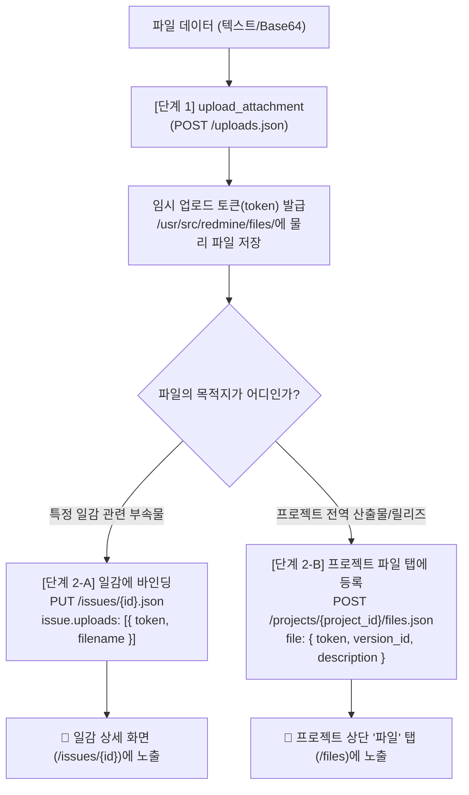

# 표준 운영 절차 (SOP): Redmine 2단계 파일 첨부 표준 절차 (Attachment Process SOP)

> [!abstract] 목적 (Purpose)
> 본 SOP는 Redmine REST API 및 MCP 도구를 활용하여 파일을 첨부할 때 준수해야 하는 **2단계(2-Phase) 파일 처리 프로세스**의 표준 절차와 트러블슈팅 지침을 정의합니다. 
> 1단계 업로드 후 왜 웹 UI에 파일이 즉시 보이지 않는지 원인을 이해하고, **일감(Issue) 첨부** 또는 **프로젝트 "파일(Files)" 탭 등록** 등 용도에 맞게 바인딩하는 절차를 안내합니다.

---

## 1. 개요 및 사전 이해 (Prerequisites)

Redmine의 파일 처리는 보안 및 효율성을 위해 **물리 파일 업로드**와 **엔티티 바인딩**이 2단계로 엄격히 분리되어 있습니다.

> [!important] 핵심 원리
> 1. **1단계 (임시 바이너리 업로드)**: 파일 데이터를 Redmine 서버 저장소(`/usr/src/redmine/files/`)에 저장하고 임시 첨부 토큰(`token`)을 획득합니다. (이 시점에는 웹 UI 미노출 상태)
> 2. **2단계 (엔티티 바인딩)**: 획득한 토큰을 목적에 따라 적절한 엔드포인트에 전달하여 최종 연결합니다:
>    - **일감 첨부**: `PUT /issues/{id}.json` 또는 `POST /issues.json` ➔ 일감 상세 화면에 노출
>    - **프로젝트 파일 탭**: `POST /projects/{project_id}/files.json` ➔ 프로젝트 상단 **"파일"** 탭에 노출

---

## 2. 일감 첨부 vs 프로젝트 "파일" 탭 비교

| 구분 | 일감 첨부파일 (Issue Attachments) | 프로젝트 "파일" 탭 (Project Files) |
|:---|:---|:---|
| **[1단계] 파일 업로드** | `POST /uploads.json` (동일) | `POST /uploads.json` (동일) |
| **[2단계] 바인딩 엔드포인트** | `PUT /issues/{id}.json`<br>또는 `POST /issues.json` | `POST /projects/{project_id}/files.json` |
| **요청 페이로드** | `{"issue": {"uploads": [{"token": "..."}]}}` | `{"file": {"token": "...", "version_id": 1}}` |
| **웹 UI 노출 위치** | 일감 상세 페이지 (`/issues/{id}`) 하단 | 프로젝트 상단 메뉴의 **"파일(Files)" 탭** |
| **주요 용도** | 버그 재현 스크린샷, 오류 로그 등 특정 일감 부속물 | 공식 릴리즈 패키지(zip/tar), 배포 바이너리, 프로젝트 공통 양식 |

---

## 3. 프로세스 흐름도 (Workflow Diagram)



---

## 4. 표준 수행 절차 (Procedure)

### [단계 1] 파일 업로드 및 토큰 발급 (`upload_attachment`)
- **행동**: 파일의 내용(텍스트 또는 Base64)을 `upload_attachment` 도구로 전달합니다.
- **도구 호출 예시**:
  ```json
  // 텍스트 파일
  {
    "filename": "server_log.txt",
    "content": "2026-09-20 ERROR: Connection timeout occurred",
    "content_type": "text/plain",
    "description": "서버 장애 로그",
    "is_base64": false
  }

  // 이미지/바이너리 (Base64)
  {
    "filename": "screenshot.png",
    "content": "iVBORw0KGgoAAAANSUhEUgAAAAEAAAABCAYAAAAfFcSJAAAADUlEQVR42mNk+M9QDwADhgGAWjR9awAAAABJRU5ErkJggg==",
    "content_type": "image/png",
    "description": "버그 재현 스크린샷",
    "is_base64": true
  }
  ```
- **검증**: 응답에 `token` 필드(`"1.e2518b5f89..."`)가 포함되어 있는지 확인합니다.

---

### [단계 2-A] 일감에 토큰 바인딩 (일감 첨부)
- **행동**: 단계 1에서 반환된 `token`을 일감 수정 또는 신규 생성 API의 `uploads` 배열에 전달합니다.
- **요청 페이로드 예시 (일감 수정: PUT /issues/{id}.json)**:
  ```json
  {
    "issue": {
      "notes": "요청하신 로그 파일을 첨부합니다.",
      "uploads": [
        {
          "token": "1.e2518b5f89bcb024e409c0d67bccf4e0a0e378d429709972f72e34287c70e5d5",
          "filename": "server_log.txt",
          "description": "서버 장애 로그",
          "content_type": "text/plain"
        }
      ]
    }
  }
  ```
- **검증**: `get_issue_details`(`include_attachments: true`)로 일감 첨부파일 및 저널 이력을 확인합니다.

---

### [단계 2-B] 프로젝트 "파일" 탭에 토큰 등록 (산출물/릴리즈 배포)
- **엔드포인트**: `POST /projects/{project_id}/files.json`
- **행동**: 단계 1에서 반환된 `token`을 프로젝트 파일 등록 API의 `file` 객체에 담아 요청합니다. 선택적으로 특정 마일스톤 버전(`version_id`)에 귀속시킬 수 있습니다.
- **요청 페이로드 예시**:
  ```json
  {
    "file": {
      "token": "3.e1892fb847028eccf600c862aaa3d8f9dd96b257c9fbfc1116dcc76ffb850292",
      "description": "프로젝트 v1.0.0 릴리즈 배포 패키지",
      "version_id": 1
    }
  }
  ```
- **검증**: `GET /projects/{project_id}/files.json` 호출 또는 웹 브라우저의 프로젝트 **"파일(Files)"** 탭에서 확인합니다.

---

## 5. 검증 및 점검 절차 (Verification)

### 5.1. 일감 첨부파일 확인
* **MCP 도구**: `get_issue_details(issue_id: 3, include_attachments: true)`
* **웹 브라우저**: `http://localhost:3000/issues/3` 하단 첨부파일 영역

### 5.2. 프로젝트 "파일" 탭 확인
* **REST API**: `GET /projects/{project_id}/files.json`
  ```json
  {
    "files": [
      {
        "id": 3,
        "filename": "release_v1.0.0.tar.gz",
        "filesize": 29,
        "content_type": "application/gzip",
        "description": "프로젝트 v1.0.0 릴리즈 배포 패키지",
        "content_url": "http://localhost:3000/attachments/download/3/release_v1.0.0.tar.gz",
        "author": { "id": 1, "name": "Redmine Admin" }
      }
    ]
  }
  ```
* **웹 브라우저**: `http://localhost:3000/projects/{project_id}/files`

### 5.3. Redmine 서버 디스크 물리 파일 확인 (인프라 관리자)
```bash
docker exec local-redmine ls -la /usr/src/redmine/files/2026/09/
```

---

## 6. 예외 처리 및 트러블슈팅 (Troubleshooting)

> [!warning] 임시 토큰 만료
> 1단계에서 발급된 토큰은 임시 토큰입니다. 장시간 바인딩하지 않으면 Redmine 정기 정리 작업(Rake task)에 의해 디스크에서 자동 삭제됩니다. 업로드 후 즉시 바인딩(단계 2-A 또는 2-B)을 수행하십시오.

> [!caution] 422 Unprocessable Entity 에러 발생 시
> Redmine 관리자 설정(`관리 > 설정 > 파일`)의 "첨부파일 최대 크기"를 초과했을 가능성이 있습니다. 파일 크기 제한을 확인하십시오.

---

#sop #attachment #upload #files-tab #redmine #mcp #api
