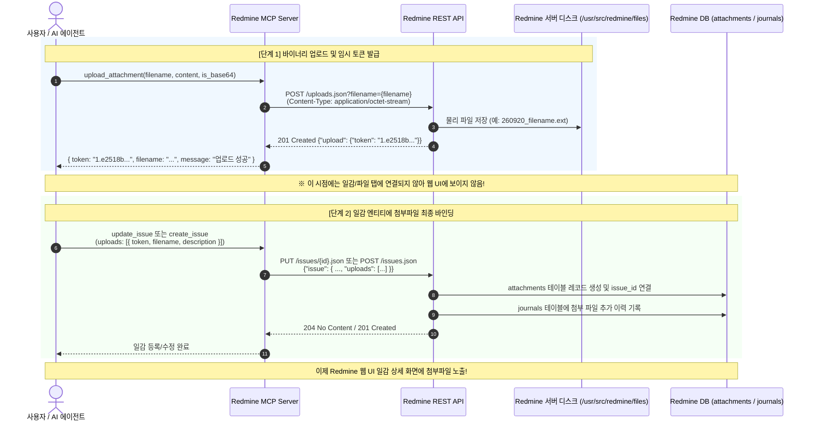

# 표준 운영 절차 (SOP): Redmine 2단계 파일 첨부 표준 절차 (Attachment Process SOP)

> [!abstract] 목적 (Purpose)
> 본 SOP는 Redmine REST API 및 MCP 도구를 활용하여 파일을 첨부할 때 준수해야 하는 **2단계(2-Phase) 파일 첨부 프로세스**의 표준 절차와 트러블슈팅 지침을 정의합니다. 1단계 업로드 후 왜 웹 UI에 파일이 즉시 보이지 않는지 원인을 이해하고, 일감(Issue)에 올바르게 바인딩하는 절차를 안내합니다.

---

## 1. 개요 및 사전 이해 (Prerequisites)

Redmine의 첨부파일 처리는 보안 및 효율성을 위해 업로드와 엔티티 바인딩이 2단계로 분리되어 있습니다.

> [!important] 핵심 원리
> 1. **1단계 (임시 업로드)**: 파일 데이터를 Redmine 서버 저장소(`/usr/src/redmine/files/`)에 저장하고 임시 첨부 토큰(`token`)을 획득합니다. (웹 UI 미노출 상태)
> 2. **2단계 (엔티티 바인딩)**: 획득한 토큰을 일감(`POST /issues.json`, `PUT /issues/{id}.json`)이나 위키의 `uploads` 배열 필드에 담아 요청하여 최종 연결합니다. (웹 UI 노출)

---

## 2. 프로세스 흐름도 (Workflow Diagram)



---

## 3. 표준 수행 절차 (Procedure)

### 단계 1: 파일 업로드 및 토큰 발급 (`upload_attachment`)
- **행동**: 파일의 내용(텍스트 또는 Base64)을 `upload_attachment` 도구로 전달합니다.
- **도구 호출 예시**:
  ```json
  // 텍스트 파일
  {
    "filename": "server_log.txt",
    "content": "2026-09-20 ERROR: Connection timeout occurred",
    "content_type": "text/plain",
    "description": "서버 장애 로그",
    "is_base64": false
  }

  // 이미지/바이너리 (Base64)
  {
    "filename": "screenshot.png",
    "content": "iVBORw0KGgoAAAANSUhEUgAAAAEAAAABCAYAAAAfFcSJAAAADUlEQVR42mNk+M9QDwADhgGAWjR9awAAAABJRU5ErkJggg==",
    "content_type": "image/png",
    "description": "버그 재현 스크린샷",
    "is_base64": true
  }
  ```
- **검증**: 응답에 `token` 필드(`"1.e2518b5f89..."`)가 포함되어 있는지 확인합니다.

---

### 단계 2: 일감에 토큰 바인딩 (일감 생성 또는 수정)
- **행동**: 단계 1에서 반환된 `token`을 일감 수정 또는 신규 생성 API의 `uploads` 배열에 전달합니다.
- **요청 페이로드 예시 (일감 수정: PUT /issues/{id}.json)**:
  ```json
  {
    "issue": {
      "notes": "요청하신 로그 파일을 첨부합니다.",
      "uploads": [
        {
          "token": "1.e2518b5f89bcb024e409c0d67bccf4e0a0e378d429709972f72e34287c70e5d5",
          "filename": "server_log.txt",
          "description": "서버 장애 로그",
          "content_type": "text/plain"
        }
      ]
    }
  }
  ```
- **검증**: 일감 상세 조회(`get_issue_details`, `include_attachments: true`)로 첨부파일 목록 및 저널 변경 이력을 확인합니다.

---

## 4. 검증 및 점검 절차 (Verification)

1. **MCP 도구를 통한 첨부 확인**:
   `get_issue_details` 도구에 `include_attachments: true`를 넘겨 호출하여 `attachments` 배열에 등록되었는지 확인:
   ```json
   {
     "issue_id": 3,
     "include_attachments": true
   }
   ```
2. **Redmine 서버 디스크 파일 확인 (인프라 관리자)**:
   ```bash
   docker exec local-redmine ls -la /usr/src/redmine/files/2026/09/
   ```

---

## 5. 예외 처리 및 트러블슈팅 (Troubleshooting)

> [!warning] 임시 토큰 만료
> 1단계에서 발급된 토큰은 임시 토큰이므로, 장시간 바인딩하지 않으면 Redmine 정기 정리 작업에 의해 디스크에서 자동 삭제됩니다. 업로드 후 즉시 바인딩을 수행하십시오.

> [!caution] 422 Unprocessable Entity 에러 발생 시
> Redmine 관리자 설정(`관리 > 설정 > 파일`)의 "첨부파일 최대 크기"를 초과했을 가능성이 있습니다. 파일 크기 제한을 확인하십시오.

---

#sop #attachment #upload #redmine #mcp #api
